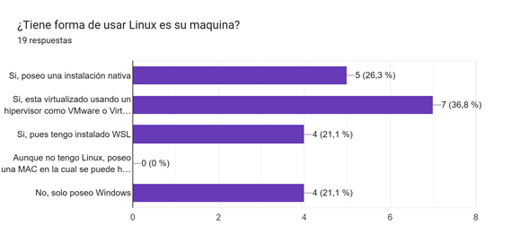
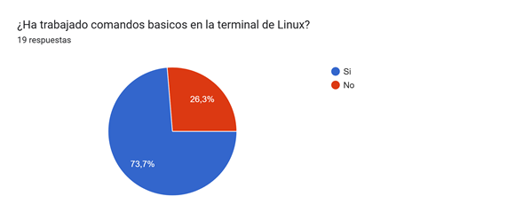
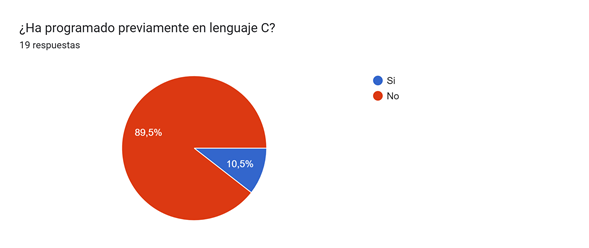

# Sesión 0 - Presentacion del laboratorio

**Fecha**: 22/08/2025

## 1. Sondeo

Sondeo diagnostico realizado entre los estudiantes de la modalidad virtual:

**Pregunta 1 - Sistema operativo instalado**

    

> [!WARNING] 
> Si va a trabajar en Linux dentro de Windows la recomendación es que instale WSL2 ([link](https://learn.microsoft.com/es-es/windows/wsl/install)).

**Pregunta 2 - Manejo de linea de comandos**

    

> [!WARNING] 
> Si es la primera vez que va a usar la consola la recomendación es que para la proxima sección del laboratorio realice la primera unidad (gratuita) del curso **Introduction to shell** de Data Camp ([link](https://www.datacamp.com/courses/introduction-to-shell)).

**Pregunta 3 - Experiencia previa con el lenguaje C**

    

> [!IMPORTANT] 
> Esta primera parte se aprenderá con la primera practica de laboratorio.

## 2. Herramientas necesarias

La siguiente lista muestra las herramientas que se van a emplear a lo largo del laboratorio:

    

<em>Figura 1. Herramientas requeridas para el laboratorio</em>

A continuación se lista las herramientas necesarias junto con algunos enlaces

- [x] **Cualquier distribución de Linux** (Ubuntu, WSL,...) [[link]](https://udea-so.github.io/udea-so/docs/laboratorio/tutoriales/herramientas/linux/)
- [x] **Compilador gcc** [[link]](https://udea-so.github.io/udea-so/docs/laboratorio/tutoriales/herramientas/gcc/)
- [x] **Make** [[link 1]](https://makefiletutorial.com/) [[link 2]](https://github.com/vampy/Makefile)
- [x] **Git** [[link]](https://learn.microsoft.com/es-es/training/modules/intro-to-git/)
- [x] **Github** [[link]](https://learn.microsoft.com/es-es/training/modules/introduction-to-github/)
- [ ] **GDB** [[link]](https://udea-so.github.io/udea-so/docs/laboratorio/tutoriales/herramientas/gdb)
- [ ] **Valgrind** [[link]](https://udea-so.github.io/udea-so/docs/laboratorio/tutoriales/herramientas/valgrinds)

## 3. Lenguaje de programación

El lenguaje C seré el empleado para el desarrollo de las practicas de laboratorio. A continuación, se muestran algunos recursos de utilidad:

1. **Introducción al lenguaje C** (Apuntes de clase)  [[link]](https://udea-so.github.io/intro-c/intro.html)
2. **CS50’s Introduction to Computer Science** (Harvard) [[link]](https://cs50.harvard.edu/summer/2025/)
3. **C for Java Programmers** (Dive into Systems) [[link]](https://diveintosystems.org/book/Appendix1/index.html)
4. **C for Python Programmers** (Real Python) [[link]](https://realpython.com/c-for-python-programmers/)
5. **Computer Organization & Systems** (Stanford) [[link]](https://web.stanford.edu/class/archive/cs/cs107/cs107.1258/) 

## 4. Recursos adicionales

A continuación se muestran algunos links con recursos adicionales

1. https://github.com/isLinXu/Stanford-CS-Course/blob/main/README.en.md
2. https://www.mit.edu/~amidi/teaching/data-science-tools/
3. https://bootlin.com/
4. https://github.com/bootlin
5. http://intrologic.stanford.edu/homepage/index.html
6. https://see.stanford.edu/Course
7. https://web.stanford.edu/class/cs106x/
8. https://web.stanford.edu/class/cs107/
9. https://web.stanford.edu/class/cs110/
10. https://web.stanford.edu/class/cs101/
11. https://web.stanford.edu/class/cs102/
12. https://web.stanford.edu/class/cs103/
13. https://web.stanford.edu/class/cs105/
14. https://cs344-stanford.github.io/
15. https://josejuansanchez.org/daw/
16. https://cs50.harvard.edu/x/
17. https://cs50.harvard.edu/ai/
18. https://cs50.harvard.edu/cybersecurity/
19. https://cs50.harvard.edu/python/
20. https://www.csl.cornell.edu/courses/ece2400/handouts.html
