# Practica 1 - Primeros pasos

## Enunciado

El enunciado y los recursos necesarios para el desarrollo de la practica 1 del laboratorio se encuentra en el siguiente [link](https://github.com/udea-so/SO-Lab1-20252). No olvide que antes de empezar debe realizar un fork de la practica.

## Primeros pasos 

### Realizacion del fork

<p align="center">
  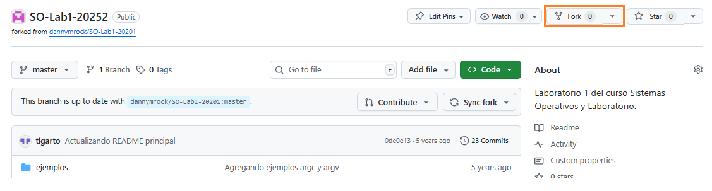
</p>

Al presionar el boton del fork, deberá aparecet una figura como la que se muestra a continuación:

<p align="center">
  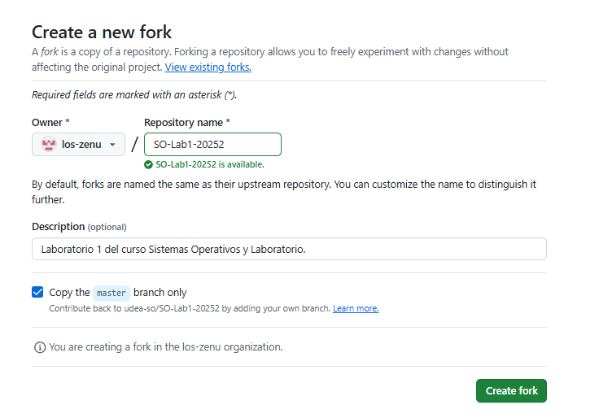
</p>

Una vez se presiona el boton **Create fork**, se realizara una copia del repositorio original en su cuenta de github tal y como se muestra en la siguiente figura:

<p align="center">
  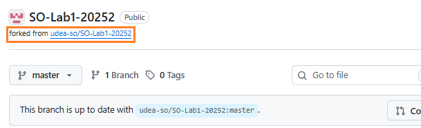
</p>

El repositorio asociado a su cuenta es el que debera trabajar para la solucion de la practica. De modo el siguiente paso es clonar este repo localmente para realizar las tareas que alli se piden.

### Clonacion del repositorio

Para trabajar localmente, lo primero que debe hacer es tener claro el directorio en el cual va a realizar sus practicas de laboratorio. Supongamos que en el caso se va a trabajar en el directorio **practicas** tal y como se muestra en la siguiente figura:

<p align="center">
  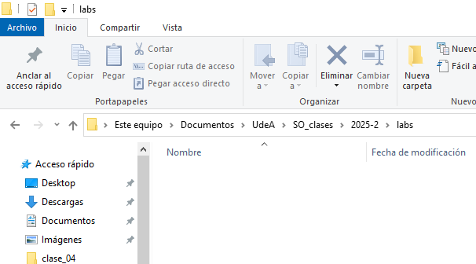
</p>

Estando en el repositorio a clonar, el primer paso presionar el boton **Clone** y copiar la dirección a clonar. 

<p align="center">
  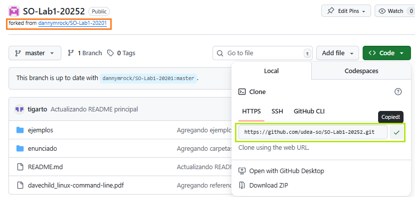
</p>

Con la consola de Linux (en esta maquina se esta usando la de WSL), ubiquese en la carpeta donde va a clonar el repositorio del laboratorio.

<p align="center">
  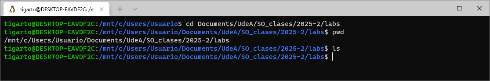
</p>

Como se puede apreciar en la figura anterior, el directorio esta vacio. Para clonar se emplea el comando **`git clone`** pasando el enlace copiado en este, tal y como se muestra en la siguiente figura:

<p align="center">
  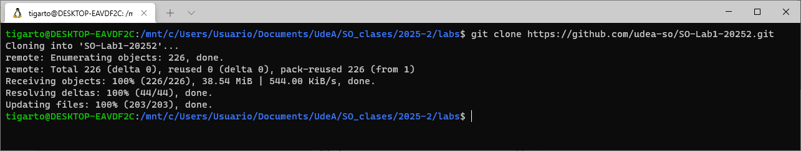
</p>

Verificamos que en efecto se haya descargado el repo localmente. En la siguiente figura se muestra el contenido descargado:

<p align="center">
  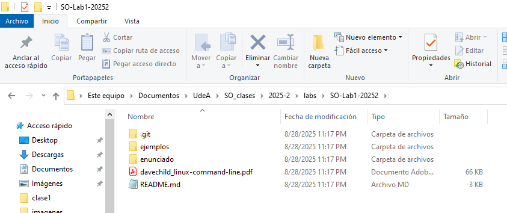
</p>

Lo que sigue a continuación es acceder al directorio en el cual se encuentra el enunciado de la practica y trabajar localmente desde este. En nuestro caso vamos a proceder a trabajar con vscode y tal como se muestra en la siguiente figura, teniendo este conectado al WSL se accede al directorio donde se encuentra el enunciado de la practica.

<p align="center">
  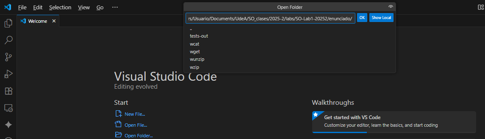
</p>

Si todo esta bien ya se podra ver los directorios con el contenido de la practica.

<p align="center">
  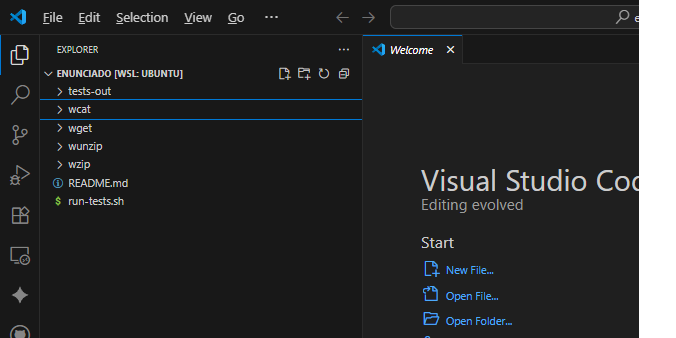
</p>

Incluso, es posible acceder a la terminal de linux:

<p align="center">
  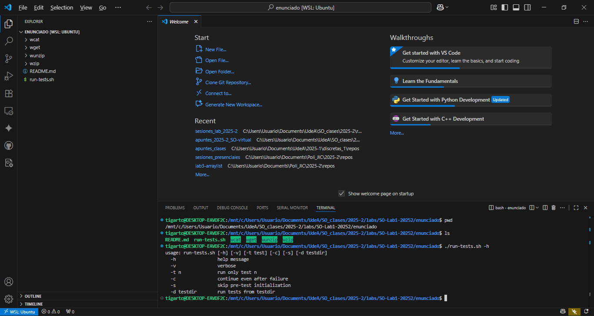
</p>

Como se puede ver, en el directorio **enunciado** se encuentra se encuentra el script **run-tests.sh** que realiza los tests automáticos de la práctica. La práctica estará completa cuando todos los test hayan sido exitosos. Ademas del **README.md** y del script **run-tests.sh** hay 4 directorios (**wcat**, **wget**, **wunzip** y **wzip**) cada uno de los cuales corresponde a cada una de las partes que se va a desarrollar.

### Trabajando en cada practica

Ya es hora de empezar y su objetivo consistira en codificar cada uno de los archivos de la practica, compilar el archivo fuente y probar el ejecutable hasta que pasen todos los test.

Suponga que va a realizar la solución del programa **`wcat`**. Los pasos para esto son:
1. Codifique el archivo fuente asociado a este programa dentro del directorio:
   
   <p align="center">
      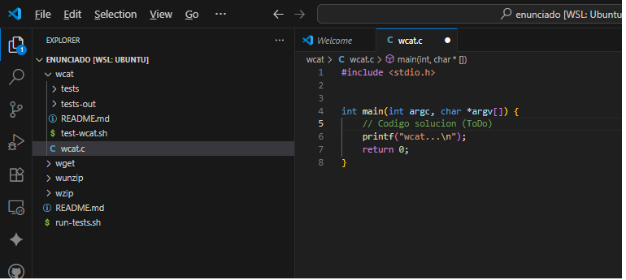
   </p>
   

2. Una vez que haya codificado el archivo, empleando la consola, acceda dentro del directorio **`wcat`** y verifique su contenido:
   
   <p align="center">
      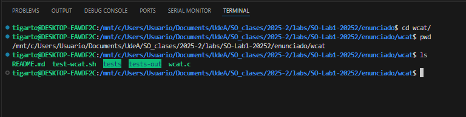
   </p>

3. Ejecute el script de test **`./test-wcat.sh`**: Si realiza este procedimiento sin haber generado el ejecutable previamente arrojara la siguiente salida:
   
   <p align="center">
      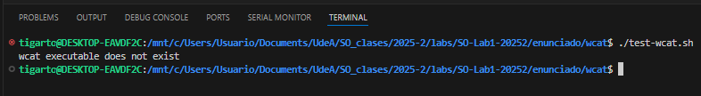
   </p>
   
   Lo anterior ocurre por que no se ha generado el ejecutable. A continuación, se genera el ejecutable y se muestra el resultado de correrlo:

   <p align="center">
      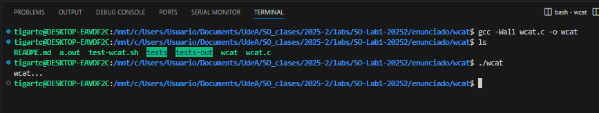
   </p>

   Como ya se tiene el ejecutable, si se corre nuevamente el test el resultado será el siguiente:

   <p align="center">
      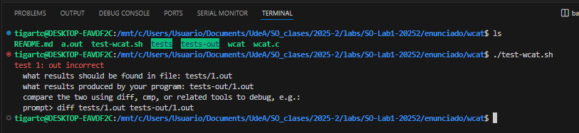
   </p>
   
   Vemos que ya se esta generando una salida. Sin embargo, el test no ha pasado por lo que es necesario codificar la aplicación hasta que pase.

El procedimiento es similar para las demas aplicaciones. La practica culmina cuando todos los test pasan

## Sobre los test

En esta sección analizamos las principales opciones para ejecutar los test para el **`wcat`**; el caso para las demas aplicaciones es similar.

Para saber los detalles de ejecución del script se pueden consultar el help:

```
./test-cat.sh -h
```

El resultado es similar a lo que se muestra a continuación:

<p align="center">
    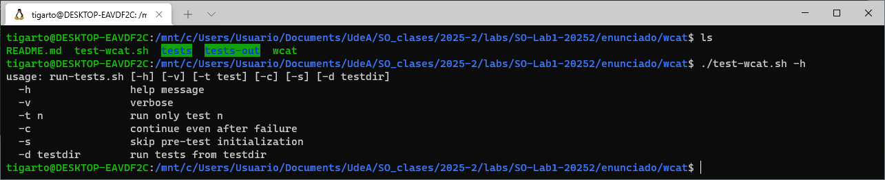
</p>

Según lo anterior, para ejecutar **todos** los test se pueden emplear cualquiera de los siguientes comandos:

```
./test-wcat.sh       # Ejecucion de los test
./test-wcat.sh -v    # Ejecucion de los test con log
```

Por ejemplo, en la siguiente figura se llevo a cabo la ejecución del primero de los comandos anteriormente mostrados:

<p align="center">
    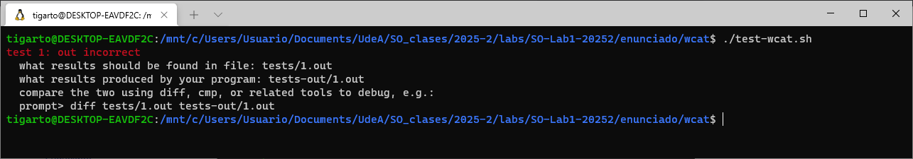
</p>


Si lo que se desea es la ejecución de **un solo** test específico, se usa el siguiente comando:

```
./test-wcat.sh -t NUMERO_PRUEBA  # Ejecucion de un test determinado
./test-wcat.sh -v -t NUMERO_PRUEBA # Ejecucion de un test determinado con log
```

La siguiente figura muestra el caso en el que se ejecuta el **test 1** sin tener los resultados de la salida de manera detallada:

<p align="center">
    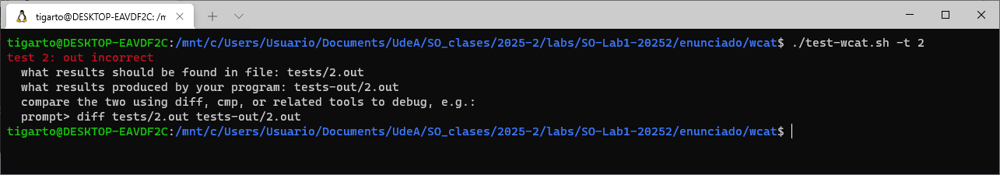
</p>

La siguiente figura muestra el caso en el que se ejecuta el **test 1** para obtener los resultados de la salida de manera detallada:

<p align="center">
    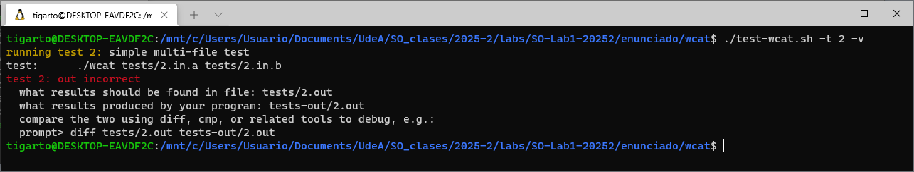
</p>
