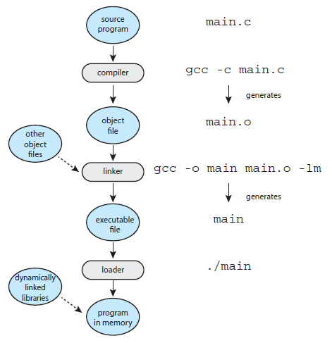

# Introducción al compilador `gcc`

## Descripción

La figura ilustra de manera esquemática el proceso de compilación y ejecución de un programa escrito en lenguaje C.

<p align="center">
  
</p>

Como se muestra en la figura anterior, el procedimiento  para pasar de un simple archivo de texto (`main.c`) a un ejcutable (`./main`) implica varios pasos intermedios los cuales son: 
1. compilar el código a un formato intermedio (`main.o`).
2. Enlazar el cogido intermedio (`main.o`) con otras piezas de código para crear el ejecutable final (`main`).
3. Cargar el ejecutable (`main`) en memoria para que se convierta en un proceso en ejecución.

## Uso basico del compilador

Para la práctica con tener claro los siguientes comandos del compilador **`gcc`** es suficiente:

1. Generación del ejecutable:
   
   ```
   gcc archivoFuente –o nombreEjecutable -Wall
   ```
   
2. Corriendo el ejecutable:
   
   ```
   ./nombreEjecutable
   ```

Por ejemplo, suponiendo que se tiene un archivo fuente con el siguiente llamado [`hola_mundo.c`](./code/hola_mundo.c) (actividad realizada previamente):

```c
#include <stdio.h>

int main() {
  printf("Hola mundo\n");
  return 0;
}
```

Si deseamos crear un ejecutable llamado `hola_mundo.out`, entonces el comando para compilar es:

```
gcc hola_mundo.c –o hola_mundo.out -Wall
```

Luego, para correr el ejecutable el comando será:

```
./hola_mundo.out
```

A continuación se muestran algunas configuraciones de compilación de gcc que pueden ser de utilidad aplicadas al ejemplo analizado:

```
gcc -o hola_mundo.out hola_mundo.c      # -o: para especificar el nombre del ejecutable
gcc -Wall hola_mundo.c                  # -Wall: da advertencias mucho mejores
gcc -g hola_mundo.c                     # -g: para habilitar la depuración con gdb
gcc -O hola_mundo.c                     # -O: para activar la optimización
```

> [!Tip]
> Es posible mezclar y combinar las banderas anteriormente mencionadas (ej., `gcc -o hola_mundo.out -g -Wall hola_mundo.c`). Para el caso, usar la bandera `-Wall` proporciona muchas más advertencias sobre posibles problemas. ¡Es importante no ignorar las advertencias!.

## Actividad guiada

1. Inicialmente liste los archivos disponibles en el directorio.
   
   ```
   ls
   ```
2. Compile el archivo [`hola_mundo.c`](./code/hola_mundo.c) previamente creado dejando que el ejecutable tenga el nombre por defecto.
   
   ```
   gcc hola_mundo.c
   ```

3. Liste nuevamente los archivos disponibles en el directorio. ¿Como se llama el ejecutable generado?
   
   ```
   ls
   ```
   
4. Ejecute el ejecutable (`./a.out`). Si todo esta bien, la salida sera similar a la siguiente:
   
   ```
   Hola mundo   
   ```

5. Compile nuevamente el archivo [`hola_mundo.c`](./code/hola_mundo.c) pero esta vez llamelo `hola.out`. Use la flag `-Wall`. Despues de generar el ejecutable, verique que este se haya generado con el comando `ls` y finalmente ejecutelo

   ```
   gcc -o hola.out hola_mundo.c -Wall    # Compilacion
   ls                                    # Verificacion
   ./hola.out                            # Ejecucion
   ```

6. Elimine los archivos ejecutables previamente generados y verifique que esto se haya realizado con exito:
   
   ```
   rm a.out hola_mundo.out    # Eliminacion
   ls                         # Verificacion
   ```

7. Realice la compilación por partes del archivo [`hola_mundo.c`](./code/hola_mundo.c) generando los archivos intermedio (`hola_mundo.o`) y ejecutable (`hola_mundo.out`). No olvide verificar con `ls`
   
   ```
   gcc -Wall -c hola_mundo.c                  # Compilacion
   gcc -Wall -o hola_mundo.out hola_mundo.o   # Enlazado
   ls                                         # Verificacion
   ```

8. Corra el ejecutable.
   
   ```
   ./hola_mundo.out
   ```

## Actividad

Empleando su editor de texto favorito, codifique el siguiente programa en lenguaje C y guardelo como `c_concepts.c`:

```c
#include <stdio.h>
#include <stdlib.h>
#include <string.h>

// Prototipos de las funciones
double sumar(double, double);
void swap(int, int);
void swap2(int*, int*);
// Funcion

int main(int argc, char *argv[]) {
    
    printf("Ejemplos sobre los principales conceptos de C\n");
    
    // ----1. Sobre salida estandar y a error ---- clear
    /*
    int age = 15;   // %d
    char sex = 'F'; // %c
    char name[] = "Chimoltrufia"; // %s
    printf("Soy la %s (sexo: %c) y tengo %d años\n", name, sex, age);
    fprintf(stderr, "Esto es un error\n");
    float peso = 2.3;         // %f
    double cosa = 1.602;  // %lf
    printf("peso = %f - cosa = %lf\n", peso, cosa);
    */

    // ----2. Sobre entrada de datos ---- //
    /* 
    int edad;
    char ciudad[51]; // 50 + 1(Null)
    printf("Por favor diga su edad: ");
    scanf("%d",&edad);
    printf("Su edad en dias es %d\n", 365*edad);
    printf("Donde vives? ");
    scanf("%s",ciudad); 
    printf("Vivo en %s",ciudad);
    */ 
    // ---3. Argumentos por linea de comandos --- //
    /*
    if(argc == 2) {
        int edad = atoi(argv[1]);
        int meses = 12*edad;
        printf("Edad %d \n", meses);                   
    } 
    else if (argc == 3) {
        printf("Hola %s tienes %d\n", argv[1],atoi(argv[2]));
    }
    else {        
        fprintf(stderr, "Se debe usa asi: edad <años> o asi edad <nombre> <años> \n"); 
    }
    */
    // --- 4. Apuntadores --- //
    /*
    int a = 3;
    printf("a = %d\n", a);
    printf("Direccion de a = &a = %p\n", &a);
    int* p; // Apuntador
    p = &a;
    printf("Direccion de a = p = %p\n", p);
    printf("a = %d = %d\n", a, *p);
    *p = *p + 2; // a = a + 2;
    printf("a = %d\n", a);
    int b;
    int* q = &b;
    *q = 0;
    int *r = p;
    *r = 2*(*p);
    printf("a = %d = %d = %d\n", a, *p, *r);
    p = &b;
    r = q;
    */
    // --- 5. Funciones --- //
    /*
    double a = 3.3, b = 4.3, c;
    c = sumar(a,b);
    printf("a + b = %.2lf + %.2lf = %.2lf\n", a, b, c);
    */

    // --- 6. Funciones por referencia y valor [apuntadores] --- //
    // Llamado por valor
    /*
    printf("Ejemplo - Llamada por por valor");
    int a_ = 3 , b_ = 4, c_;
    printf("a_ = %d ; b_ = %d\n", a_, b_);
    swap(a_, b_);
    printf("a_ = %d ; b_ = %d\n", a_, b_); 
    // Llamado por referencia
    printf("Ejemplo - Llamada por referencia\n");
    printf("a_ = %d ; b_ = %d\n", a_, b_);
    swap2(&a_, &b_);
    printf("a_ = %d ; b_ = %d\n", a_, b_);
    */
    return 0;
}

// ------------------------- Definicion de funciones --------------------------------

double sumar(double x, double y) {
  return x + y;
}

void swap(int x, int y) {
    int z;
    z = x;
    x = y;
    y = z; 
}

void swap2(int* x, int* y) {
    int z;
    z = *x;
    *x = *y;
    *y = z; 
}
```

Luego, empleando el compilador `gcc` realice las siguientes actividades:
1. Genere un ejecutable llamado `examples.out` y ejecutelo. **Nota**: Use la bandera `Wall` para compilar.
2. Comente la linea que genera el mensaje en pantalla `Ejemplos sobre los principales conceptos de C` y descomente las lineas de codigo asociadas a la primera demostración:
   
   ```c
   #include <stdio.h>
   #include <stdlib.h>
   #include <string.h>

   // Prototipos de las funciones
   double sumar(double, double);
   void swap(int, int);
   void swap2(int*, int*);
   // Funcion

   int main(int argc, char *argv[]) {
    
     // printf("Ejemplos sobre los principales conceptos de C\n");
    
     // ----1. Sobre salida estandar y a error ---- clear
     
     int age = 15;   // %d
     char sex = 'F'; // %c
     char name[] = "Chimoltrufia"; // %s
     printf("Soy la %s (sexo: %c) y tengo %d años\n", name, sex, age);
     fprintf(stderr, "Esto es un error\n");
     float peso = 2.3;         // %f
     double cosa = 1.602;  // %lf
     printf("peso = %f - cosa = %lf\n", peso, cosa);
    

     // ----2. Sobre entrada de datos ---- //
     
     // ...

     return 0;
   }
   // ...
   ```

3. Recompile y genere el ejecutable llamado `example1.out` y ejecutelo.
4. Repita el procedimiento anterior, descomentando ahora el codigo asociado a la segunda demostración y comentando el codigo de la demostración 1. Genere un ejecutable de nombre `example2.out` y ejecutelo.
5. Repita el procedimiento anterios para los demas ejemplos generando cada uno de los ejecutables con el respectivo nombre asociado al ejemplo.


#### Material de apoyo

> 1. **Laboratory: Tutorial**  [[link]](https://pages.cs.wisc.edu/~remzi/OSTEP/lab-tutorial.pdf)
> 2. **Una Introducción a GCC** [[link]](https://www.nongnu.org/gccintro-es/gccintro.es.pdf)

#### Reference sheet

> **ECE 2400 Linux, Git, C/C++ Cheat Sheet** [[link]](../summary/ece2400-cheat-sheet.pdf)