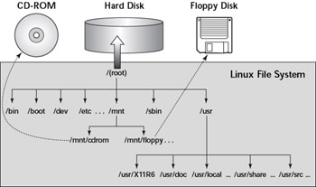
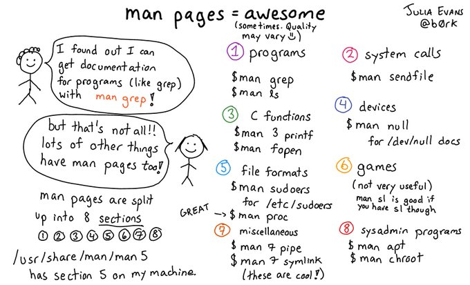
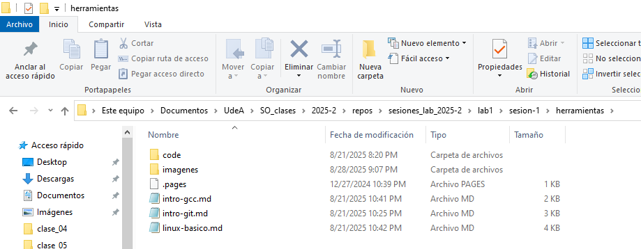
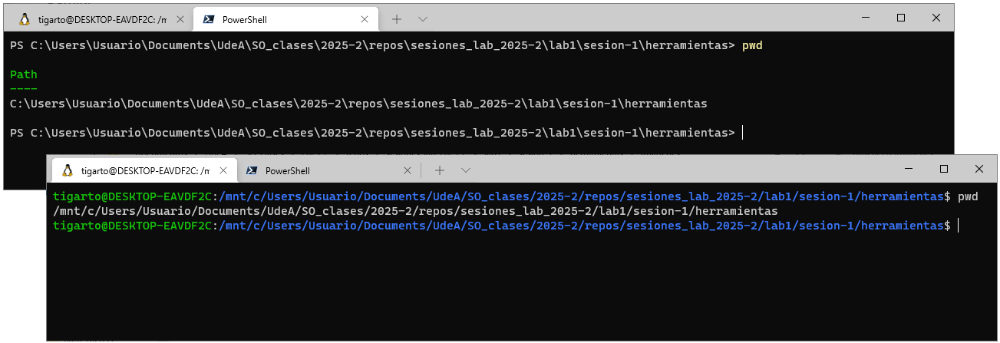
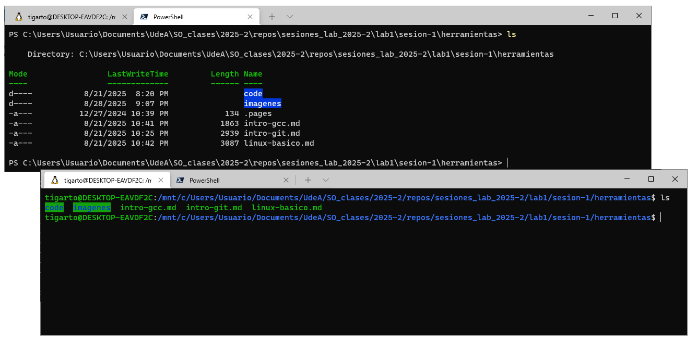

# Linux básico

## Conceptos basicos

En linux todo es un archivo (directorios, archivos como tal y dispositivos). En linux el sistema de archivos se organiza en una estructura jerárquica a modo de arbol, siendo el nivel más alto del sistema el directorio raíz (`/`) tal y como se muestra en la siguiente figura:

<p align="center">
  
</p>

La siguiente tabla muestra algunos comandos comunmente usados:

| Comando  | Descripción                                                                      |
| -------- | -------------------------------------------------------------------------------- |
| `whatis` | Muestra de manera resumida lo que hace un comando.                               |
| `man`    | Muestra el manual de comandos                                                    |
| `pwd`    | Imprime la ruta del directorio de trabajo actual                                 |
| `cd`     | Cambia el directorio de trabajo actual                                           |
| `ls`     | Lista los el contenido (archivos y directorios) del directorio de trabajo actual |
| `clear`  | Limpia pantalla                                                                  |
| `mkdir`  | Crea un nuevo directorio                                                         |
| `rmdir`  | Borrar directorio                                                                |
| `cp`     | Copia archivos y directorios                                                     |
| `rm`     | Borra archivos y directorios                                                     |
| `mv`     | Mueve o renombra archivos                                                        |

De todos los comandos, el manual (`man`) es muy importante, la siguiente imagen de [Julia Evans](https://x.com/b0rk) resume cómo usarlo:



También es bueno tener en cuenta que cuando se quiera navegar en consola, por medio del comando `cd`, a través del sistema de archivos recordar algunos los directorios especiales empleados en linux:

## Sobre las rutas

Para la administración de archivos y la ejecución de comandos en cualquier sistema operativo es necesario comprende el concetp de **rutas**. Una **ruta** (**path**) se define como una cadena de caracteres que especifica la ubicación única de un archivo o directorio dentro de un sistema de archivos. 

<p align="center">
  
</p>

La estrutructura de una ruta depende del sistema operativo tal y como se muestra a continuación:
* **Windows**: `C:\Users\Usuario\Documents\UdeA\SO_clases\2025-2\repos\sesiones_lab_2025-2\lab1\sesion-1\herramientas`
* **Linux**: `/mnt/c/Users/Usuario/Documents/UdeA/SO_clases/2025-2/repos/sesiones_lab_2025-2/lab1/sesion-1/herramientas`

La siguiente figura muestra el caso al ejecutar el comando `pwd`:

<p align="center">
  
</p>

Para navegar en el sistema de archivos se ejecuta el comando `cd` con la ruta deseada la cual puede ser absoluta o relativa.
* **Ruta absoluta**: en esta se especifica la ubicación el directorio raíz (/ o C:\).
* **Ruta relativa**: en esta se especifica la ubicación de un archivo o directorio en relación con la ubicación actual (`.`). Mediante el uso de indicadores especiales es posible navegar entre directorios a partir del directorio actual. La siguiente tabla muestra algunos indicadores especiales:
  
  | Directorio | Descripción       |
  | ---------- | ---------------------------------------------- |
  | `/`     | Directorio                                        |
  | `./`    | Directorio actual                                 |
  | `../`   | Directorio padre del directorio actual (directorio en el cual me encuentro ubicado) |

Cuando se esta en un directorio, es util listar los archivos que en este se encuentran, esto se hace con el comando `ls`:

<p align="center">
  
</p>

### Actividad

1. Empleando linea de comandos crea un directorio en una ubicacion conocida llamado `sesion_lab_1`
2. Ingrese a este directorio empleando el comando `cd`
3. Liste los archivos usando `ls`.
4. Empleando un editor de texto, crea un archivo de texto llamado: `hola_mundo.c` este tendrá el siguiente contenido:
   
   ```c
   #include <stdio.h>

   int main() {
      printf("Hola mundo\n");
      return 0;
   }
   ```
   
5. Una vez guardado el archivo siga el siguiente [link](intro-gcc.md) en el cual se explica como compilar un programa en C.
   


#### Material de apoyo

> 1. **Linux básico** (material del curso) [[link]](https://udea-so.github.io/udea-so/docs/laboratorio/tutoriales/herramientas/linux)
> 2. **Working with Bash** (MIT) [[link]](https://www.mit.edu/~amidi/teaching/data-science-tools/study-guide/engineering-productivity-tips/#working-with-bash)
> 3. **The Unix and GNU/Linux command line** (Free Electrons) [[link]](https://bootlin.com/doc/legacy/command-line/unix_linux_introduction.pdf)

#### Reference sheet

> **GNU/Linux most wanted** [[link]](https://bootlin.com/doc/legacy/command-line/command_memento.pdf)