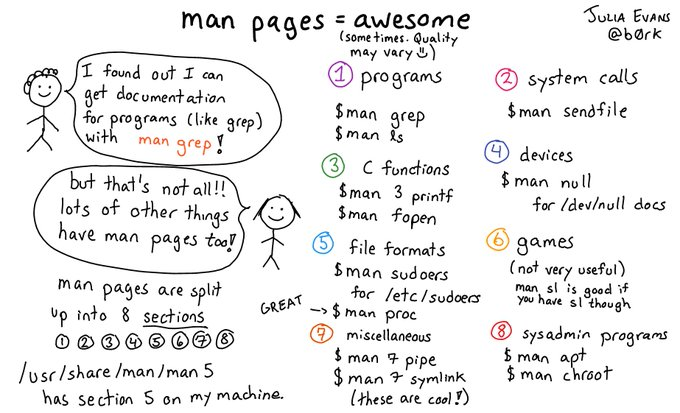

# Linux básico

En linux todo es un archivo (directorios, archivos como tal y dispositivos). En linux el sistema de archivos se organiza en una estructura jerárquica a modo de arbol, siendo el nivel más alto del sistema el directorio raíz (`/`) tal y como se muestra en la siguiente figura:

| Comando  | Descripción                                                                      |
| -------- | -------------------------------------------------------------------------------- |
| `whatis` | Muestra de manera resumida lo que hace un comando.                               |
| `man`    | Muestra el manual de comandos                                                    |
| `pwd`    | Imprime la ruta del directorio de trabajo actual                                 |
| `cd`     | Cambia el directorio de trabajo actual                                           |
| `ls`     | Lista los el contenido (archivos y directorios) del directorio de trabajo actual |
| `clear`  | Limpia pantalla                                                                  |
| `mkdir`  | Crea un nuevo directorio                                                         |
| `rmdir`  | Borrar directorio                                                                |
| `cp`     | Copia archivos y directorios                                                     |
| `rm`     | Borra archivos y directorios                                                     |
| `mv`     | Mueve o renombra archivos                                                        |

De todos los comandos, el manual (`man`) es muy importante, la siguiente imagen de [Julia Evans](https://x.com/b0rk) resume cómo usarlo:

También es bueno tener en cuenta que cuando se quiera navegar en consola, por medio del comando `cd`, a través del sistema de archivos recordar algunos los directorios especiales empleados en linux:

| Directorio | Descripción                                                                         |
| ---------- | ----------------------------------------------------------------------------------- |
| `/`        | Directorio raíz                                                                     |
| `.`/       | Directorio actual                                                                   |
| `..`/      | Directorio padre del directorio actual (directorio en el cual me encuentro ubicado) |

#### Material de apoyo

> 1. **Linux básico** (material del curso) [[link]](https://udea-so.github.io/udea-so/docs/laboratorio/tutoriales/herramientas/linux)
> 2. **Working with Bash** (MIT) [[link]](https://www.mit.edu/~amidi/teaching/data-science-tools/study-guide/engineering-productivity-tips/#working-with-bash)
> 3. **The Unix and GNU/Linux command line** (Free Electrons) [[link]](https://bootlin.com/doc/legacy/command-line/unix_linux_introduction.pdf)

#### Reference sheet

> **GNU/Linux most wanted** [[link]](https://bootlin.com/doc/legacy/command-line/command_memento.pdf)