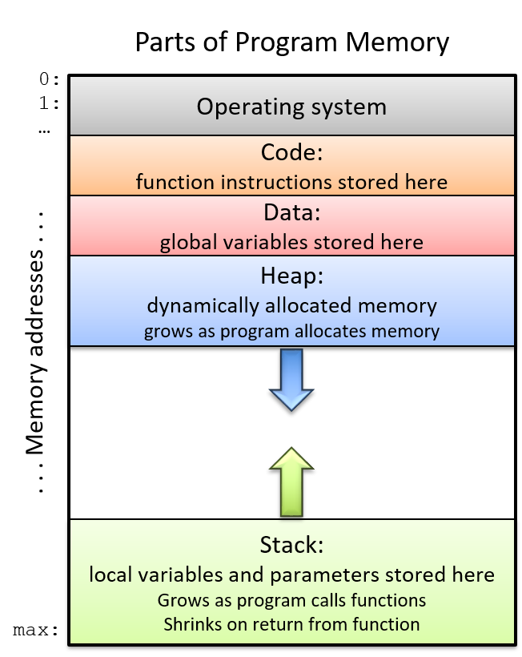

# Manejo de estructuras

## 1. Introducción

En el lenguaje C, la estructura (`struct`) es un tipo de dato compuesto fundamental que permite la agregación de datos, resolviendo el problema de gestionar información relacionada de tipos heterogéneos que, de otro modo, requeriría el uso de arreglos paralelos, una práctica ineficiente y propensa a errores.

Para personas con experiencia previa en Java o Python, una `struct` puede ser conceptualizada como ***una clase que contiene únicamente atributos (campos) y carece de métodos***. Su propósito principal es encapsular las propiedades de una entidad del mundo real (como un "Estudiante" con su nombre, código y promedio) en una sola variable, lo que resulta en un código significativamente más organizado, legible y mantenible al garantizar que los datos lógicamente cohesivos permanezcan físicamente agrupados.

Para poner estos conceptos en práctica, el siguiente directorio de ejemplos ilustra cómo se definen y manipulan estas estructuras en C. Los ejercicios se enfocan en afianzar la comprensión sobre la organización de datos y la gestión de memoria, aspectos clave que diferencian el manejo de objetos en C de lenguajes como Java o Python.

> [!tip]
> * https://diveintosystems.org/book/C2-C_depth/structs.html
> * https://udea-so.github.io/intro-c/content/CH_02-S04.html


## 2. Aspectos Teóricos Fundamentales de las Estructuras en C

Antes de analizar el código, es crucial comprender cuatro conceptos que gobiernan cómo se definen, usan y manipulan las estructuras (`struct`) en C.

### 2.1. Declaración y `typedef`: El Molde vs. el Objeto Real

Una **`struct`** es una **plantilla** o "molde" que define cómo agrupar un conjunto de variables de diferentes tipos en una sola unidad. Por sí sola, la declaración de una estructura no reserva memoria para los datos; simplemente crea un nuevo tipo de dato compuesto.

* **Declaración Estándar:**
  
    ```c
    struct Estudiante {
        char nombre[50];
        int codigo;
    };
    ```
* **Creación de una Variable:** Para usarla, se debe crear una variable de ese tipo:
  
    ```c
    struct Estudiante estudiante1;
    ```

Para simplificar la creación de variables, se utiliza **`typedef`**, que crea un **alias** o un "apodo" para el tipo de estructura. Esta es la práctica más común.

* **Uso de `typedef`:**
  
    ```c
    typedef struct {
        char nombre[50];
        int codigo;
    } Estudiante; // 'Estudiante' es ahora el alias.
    
    Estudiante estudiante1; // Sintaxis más limpia y directa.
    ```

### 2.2. Acceso a Miembros: El Punto (`.`) vs. La Flecha (`->`)
Esta es la regla de oro para manipular los datos dentro de una estructura, y depende de de si se tiene la variable directamente o un puntero a ella.

* **Operador Punto (`.`):** Se utiliza cuando se trabaja con la **variable de forma directa**.
  
    ```c
    Estudiante est;
    est.codigo = 123; // Acceso directo.
    ```

* **Operador Flecha (`->`):** Se utiliza cuando se tiene un **puntero** a la estructura.
  
    ```c
    Estudiante* ptr_est = &est;
    ptr_est->codigo = 456; // Acceso a través de un puntero.
    ```
La sintaxis de flecha `ptr_est->codigo` es simplemente un atajo más legible para no tener que escribir `(*ptr_est).codigo`.

### 2.3. Gestión de Memoria: Stack vs. Heap

A diferencia de otros lenguajes que cuentan con mecanismos de recolección automática de basura, en C la gestión de la memoria recae directamente en el programador. Por ello, resulta fundamental conocer el **mapa de memoria**, ya que este proporciona una visión clara de dónde y cómo se almacenan los diferentes tipos de datos durante la ejecución de un programa. La figura ilustra la organización típica de la memoria de un proceso dentro de un sistema operativo, distinguiendo secciones específicas como el segmento de código, el área de datos, el heap y el stack, cada una con funciones y características particulares que el programador debe comprender para garantizar un uso correcto y eficiente de los recursos de memoria.



En el caso de las estructuras, estas pueden existir en dos lugares distintos:
* **En el Stack (Memoria Automática):** Cuando se declara una estructura dentro de una función (`Estudiante mi_est;`), se aloja en el Stack. Su vida está limitada al ámbito de esa función; se crea al entrar y se destruye automáticamente al salir.
* **En el Heap (Memoria Dinámica):** Para que una estructura persista más allá de la función que la creó, es necesario asignarle memoria manualmente en el Heap usando **`malloc()`** la cual siempre devolverá un **puntero**. La memoria asignada de esta forma debe ser liberada explícitamente con **`free()`** para evitar fugas de memoria (*memory leaks*).
  
    ```c
    Estudiante* est_dinamico = (Estudiante*) malloc(sizeof(Estudiante));
    // ... usar la estructura ...
    free(est_dinamico); // Tu responsabilidad es liberarla.
    ```

### 2.4. Paso a Funciones: Por Valor vs. Por Puntero

La forma en que se pasa una estructura a una función afecta el rendimiento y si se pueden o no modificar los datos originales.

* **Paso por Valor (Copia):** Se crea una **copia completa** de la estructura. La función trabaja sobre esta copia, por lo que **no puede modificar la estructura original**. Este método puede ser muy ineficiente si la estructura contiene muchos datos.
  
  ```c
  void miFuncion(Estudiante est)
  ```

* **Paso por Puntero (Referencia):** 
    Se pasa únicamente la **dirección de memoria** de la estructura. Es extremadamente rápido y eficiente. Además, al tener la dirección, la función **sí puede modificar los datos de la estructura original**.

    ```c
    void miFuncion(Estudiante* ptr_est)
    ```

Por eficiencia y flexibilidad, **el paso por puntero es el método estándar y preferido** en la programación en C.

## 3. Ejemplos introductorios

A continuación se muestran varios ejemplos sencillos donde se aplican los conceptos fundamentales sobre estructuras previamente tratados.

> [!Warning]
> La parte relacionada con el manejo del **heap** se tratará en el seccion de manejo de memoria dinamica.

### 3.1. Definición y declaración

El siguiente ejemplo muestra cómo definir y usar una estructura en C ([simulacion](https://pythontutor.com/render.html#code=%23include%20%3Cstdio.h%3E%0A%0A//%20Definici%C3%B3n%20de%20la%20estructura%0Astruct%20Persona%20%7B%0A%20%20%20%20char%20nombre%5B50%5D%3B%0A%20%20%20%20int%20edad%3B%0A%7D%3B%0A%0Aint%20main%28%29%20%7B%0A%20%20%20%20//%20Declaraci%C3%B3n%20de%20una%20variable%20de%20tipo%20estructura%0A%20%20%20%20struct%20Persona%20p1%3B%0A%0A%20%20%20%20//%20Asignaci%C3%B3n%20de%20valores%0A%20%20%20%20p1.edad%20%3D%2020%3B%0A%20%20%20%20printf%28%22Edad%3A%20%25d%5Cn%22,%20p1.edad%29%3B%0A%0A%20%20%20%20return%200%3B%0A%7D&cumulative=false&curInstr=0&heapPrimitives=nevernest&mode=display&origin=opt-frontend.js&py=c_gcc9.3.0&rawInputLstJSON=%5B%5D&textReferences=false)). 

**Archivo**: [ej1_declaracion_structs.c](comparacion_lenguajes/c/ej1_declaracion_structs.c)


```c
#include <stdio.h>

// Definición de la estructura
struct Persona {
    char nombre[50];
    int edad;
};

int main() {
    // Declaración de una variable de tipo estructura
    struct Persona p1;

    // Asignación de valores
    p1.edad = 20;
    printf("Edad: %d\n", p1.edad);

    return 0;
}
```

### 3.2. Acceso a los miembros con el operador `.`

Este ejemplo muestra como acceder a los miembros de la estructura. Para el caso se uso la función como `strcpy` para manejar cadenas en estructuras. ([simulacion](https://pythontutor.com/render.html#code=%23include%20%3Cstdio.h%3E%0A%23include%20%3Cstring.h%3E%0A%0Astruct%20Persona%20%7B%0A%20%20%20%20char%20nombre%5B50%5D%3B%0A%20%20%20%20int%20edad%3B%0A%7D%3B%0A%0Aint%20main%28%29%20%7B%0A%20%20%20%20struct%20Persona%20p1%3B%0A%0A%20%20%20%20strcpy%28p1.nombre,%20%22Ana%20Perez%22%29%3B%0A%20%20%20%20p1.edad%20%3D%2022%3B%0A%0A%20%20%20%20printf%28%22Nombre%3A%20%25s%5Cn%22,%20p1.nombre%29%3B%0A%20%20%20%20printf%28%22Edad%3A%20%25d%5Cn%22,%20p1.edad%29%3B%0A%0A%20%20%20%20return%200%3B%0A%7D&cumulative=false&curInstr=0&heapPrimitives=nevernest&mode=display&origin=opt-frontend.js&py=c_gcc9.3.0&rawInputLstJSON=%5B%5D&textReferences=false))

**Archivo**: [ej2_acceso_punto_structs.c](comparacion_lenguajes/c/ej2_acceso_punto_structs.c)

```c
#include <stdio.h>
#include <string.h>

struct Persona {
    char nombre[50];
    int edad;
};

int main() {
    struct Persona p1;

    strcpy(p1.nombre, "Ana Perez");
    p1.edad = 22;

    printf("Nombre: %s\n", p1.nombre);
    printf("Edad: %d\n", p1.edad);

    return 0;
}
```

### 3.3. Uso de `typedef` para simplificar

Mediante el uso de un alias, se facilita la declaración de un tipo de dato asociado a una estructura al evitar repetir la palabra clave `struct`. ([simulacion](https://pythontutor.com/render.html#code=%23include%20%3Cstdio.h%3E%0A%0Atypedef%20struct%20%7B%0A%20%20%20%20char%20nombre%5B50%5D%3B%0A%20%20%20%20int%20edad%3B%0A%7D%20Persona%3B%0A%0Aint%20main%28%29%20%7B%0A%20%20%20%20Persona%20p1%20%3D%20%7B%22Luis%20Gomez%22,%2030%7D%3B%0A%20%20%20%20Persona%20p2%20%3D%20%7B.nombre%20%3D%20%22Marta%20Peralta%22,%20%0A%20%20%20%20%20%20%20%20%20%20%20%20%20%20%20%20%20%20.edad%20%3D%2030%7D%3B%0A%0A%20%20%20%20printf%28%22%25s%20tiene%20%25d%20a%C3%B1os%5Cn%22,%20p1.nombre,%20p1.edad%29%3B%0A%20%20%20%20printf%28%22%25s%20tiene%20%25d%20a%C3%B1os%5Cn%22,%20p2.nombre,%20p2.edad%29%3B%0A%0A%20%20%20%20return%200%3B%0A%7D&cumulative=false&curInstr=0&heapPrimitives=nevernest&mode=display&origin=opt-frontend.js&py=c_gcc9.3.0&rawInputLstJSON=%5B%5D&textReferences=false))

**Archivo**: [ej3_typedef_structs.c](comparacion_lenguajes/c/ej3_typedef_structs.c)

```c
#include <stdio.h>

typedef struct {
    char nombre[50];
    int edad;
} Persona;

int main() {
    Persona p1 = {"Luis Gomez", 30};
    Persona p2 = {.nombre = "Marta Peralta", 
                  .edad = 30};

    printf("%s tiene %d años\n", p1.nombre, p1.edad);
    printf("%s tiene %d años\n", p2.nombre, p2.edad);

    return 0;
}
```

### 3.4. Punteros a estructuras y operador `->`

El siguiente ejemplo introduce el acceso indirecto mediante punteros. ([simulacion](https://pythontutor.com/render.html#code=%23include%20%3Cstdio.h%3E%0A%0Atypedef%20struct%20%7B%0A%20%20%20%20char%20nombre%5B50%5D%3B%0A%20%20%20%20int%20edad%3B%0A%7D%20Persona%3B%0A%0Aint%20main%28%29%20%7B%0A%20%20%20%20Persona%20p1%20%3D%20%7B%22Marta%22,%2025%7D%3B%0A%20%20%20%20Persona%20*ptr%20%3D%20%26p1%3B%0A%0A%20%20%20%20//%20Acceso%20con%20operador%20-%3E%0A%20%20%20%20printf%28%22Nombre%3A%20%25s%5Cn%22,%20ptr-%3Enombre%29%3B%0A%20%20%20%20printf%28%22Edad%3A%20%25d%5Cn%22,%20ptr-%3Eedad%29%3B%0A%0A%20%20%20%20return%200%3B%0A%7D&cumulative=false&curInstr=0&heapPrimitives=nevernest&mode=display&origin=opt-frontend.js&py=c_gcc9.3.0&rawInputLstJSON=%5B%5D&textReferences=false))

**Archivo**: [ej4_acceso_flecha_structs.c](comparacion_lenguajes/c/ej4_acceso_flecha_structs.c)

```c
#include <stdio.h>

typedef struct {
    char nombre[50];
    int edad;
} Persona;

int main() {
    Persona p1 = {"Marta", 25};
    Persona *ptr = &p1;

    // Acceso con operador ->
    printf("Nombre: %s\n", ptr->nombre);
    printf("Edad: %d\n", ptr->edad);

    return 0;
}
```

### 3.5. Paso de estructuras a funciones

Aunque al llamar funciones es posible el paso de estructuras por valor, es mas recomendable parar dichas estructuras como parametros por referencia mediante el uso de puntero. ([simulacion](https://pythontutor.com/render.html#code=%23include%20%3Cstdio.h%3E%0A%0Atypedef%20struct%20%7B%0A%20%20%20%20char%20nombre%5B50%5D%3B%0A%20%20%20%20int%20edad%3B%0A%7D%20Persona%3B%0A%0A//%20Paso%20por%20referencia%20%28puntero%29%0Avoid%20imprimir%28Persona%20*p%29%20%7B%0A%20%20%20%20printf%28%22%25s%20tiene%20%25d%20a%C3%B1os%5Cn%22,%20p-%3Enombre,%20p-%3Eedad%29%3B%0A%7D%0A%0Aint%20main%28%29%20%7B%0A%20%20%20%20Persona%20p1%20%3D%20%7B%22Carlos%22,%2028%7D%3B%0A%0A%20%20%20%20imprimir%28%26p1%29%3B%0A%0A%20%20%20%20return%200%3B%0A%7D&cumulative=false&curInstr=0&heapPrimitives=nevernest&mode=display&origin=opt-frontend.js&py=c_gcc9.3.0&rawInputLstJSON=%5B%5D&textReferences=false))

**Archivo**: [ej5_funciones_structs.c](comparacion_lenguajes/c/ej5_funciones_structs.c)


```c
#include <stdio.h>

typedef struct {
    char nombre[50];
    int edad;
} Persona;

// Paso por referencia (puntero)
void imprimir(Persona *p) {
    printf("%s tiene %d años\n", p->nombre, p->edad);
}

int main() {
    Persona p1 = {"Carlos", 28};

    imprimir(&p1);

    return 0;
}
```

## 4. Actividad Preliminar: Compilación y analisis de ejemplos

Para proceder con el análisis, es necesario descargar, descomprimir y compilar los archivos fuente proporcionados.

1. **Descargar y descomprimir**: Obtenga el archivo [`structs_examples.zip`](structs_examples.zip) y extráigalo en un directorio de trabajo.
   
   ```bash
   unzip structs_examples.zip
   ```

2. **Acceder al Directorio**: Navegue hacia el directorio resultante (`structs_examples`).

   ```bash
   cd structs_examples
   ```

   > [!Tip]
   > Despues de acceder acceder al directorio, empleando el comando `ls`, liste los archivos que se encuentran en este y verifique que se encuentre el archivo `Makefile`

3. **Compilar los Ejemplos**: Utilice la utilidad make para compilar los archivos fuente (.c). Este proceso generará un archivo ejecutable por cada fuente.

   ```bash
   make
   ```

4. **Ejecute los ejecutables generados**: Corra cada uno de los ejecutables generados previamente empleando el siguiente comando:

   ```bash
   ./nombreEjecutable
   ```

A continuación se muestra la lista de ejemplos la siguiente lista de ejemplos:
1. [structs01.c](structs01.c) - [[simulacion](https://pythontutor.com/render.html#code=/*%0ABook%3A%20Programming%20in%20C%0AAuthor%3A%20Stephen%20G.%20Kochan%0A*/%0A%0A%23include%20%3Cstdio.h%3E%0A%0Aint%20main%28void%29%20%7B%0A%20%20%20%20struct%20date%20%7B%0A%20%20%20%20%20%20%20%20int%20month%3B%0A%20%20%20%20%20%20%20%20int%20day%3B%0A%20%20%20%20%20%20%20%20int%20year%3B%0A%20%20%20%20%7D%3B%0A%20%20%20%20struct%20date%20today%3B%0A%20%20%20%20%0A%20%20%20%20today.month%20%3D%209%3B%0A%20%20%20%20today.day%20%3D%2025%3B%0A%20%20%20%20today.year%20%3D%202004%3B%0A%0A%20%20%20%20printf%28%22Today's%20date%20is%20%25i/%25i/%25.2i.%5Cn%22,%20today.month,%20today.day,%0A%20%20%20%20%20%20%20%20%20%20%20today.year%29%3B%0A%20%20%20%20return%200%3B%0A%7D&cumulative=false&curInstr=0&heapPrimitives=nevernest&mode=display&origin=opt-frontend.js&py=c_gcc9.3.0&rawInputLstJSON=%5B%5D&textReferences=false)]
2. [structs02.c](structs02.c) 
3. [structs03.c](structs03.c) 
4. [structs04.c](structs04.c)
5. [structs05.c](structs05.c)- [[simulacion](https://pythontutor.com/render.html#code=/*%0ABook%3A%20Programming%20in%20C%0AAuthor%3A%20Stephen%20G.%20Kochan%0A*/%0A%0A//%20Program%20to%20illustrate%20arrays%20of%20structures%0A%23include%20%3Cstdio.h%3E%0A%0Astruct%20time%20%7B%0A%20%20%20%20int%20hour%3B%0A%20%20%20%20int%20minutes%3B%0A%20%20%20%20int%20seconds%3B%0A%7D%3B%0A%0Astruct%20time%20timeUpdate%28struct%20time%29%3B%0A%0Aint%20main%28void%29%20%7B%0A%20%20%20%20struct%20time%20timeUpdate%28struct%20time%20now%29%3B%0A%20%20%20%20struct%20time%20testTimes%5B5%5D%20%3D%0A%20%20%20%20%20%20%20%20%7B%7B11,%2059,%2059%7D,%20%7B12,%200,%200%7D,%20%7B1,%2029,%2059%7D,%20%7B23,%2059,%2059%7D,%20%7B19,%2012,%2027%7D%7D%3B%0A%20%20%20%20int%20i%3B%0A%20%20%20%20for%20%28i%20%3D%200%3B%20i%20%3C%205%3B%20%2B%2Bi%29%20%7B%0A%20%20%20%20%20%20%20%20printf%28%22Time%20is%20%25.2i%3A%25.2i%3A%25.2i%22,%20testTimes%5Bi%5D.hour,%0A%20%20%20%20%20%20%20%20%20%20%20%20%20%20%20testTimes%5Bi%5D.minutes,%20testTimes%5Bi%5D.seconds%29%3B%0A%20%20%20%20%20%20%20%20testTimes%5Bi%5D%20%3D%20timeUpdate%28testTimes%5Bi%5D%29%3B%0A%20%20%20%20%20%20%20%20printf%28%22%20...one%20second%20later%20it's%20%25.2i%3A%25.2i%3A%25.2i%5Cn%22,%0A%20%20%20%20%20%20%20%20%20%20%20%20%20%20%20testTimes%5Bi%5D.hour,%20testTimes%5Bi%5D.minutes,%20testTimes%5Bi%5D.seconds%29%3B%0A%20%20%20%20%7D%0A%20%20%20%20return%200%3B%0A%7D%0A%0A//%20Function%20to%20update%20the%20time%20by%20one%20second%0Astruct%20time%20timeUpdate%28struct%20time%20now%29%20%7B%0A%20%20%20%20%2B%2Bnow.seconds%3B%0A%20%20%20%20if%20%28now.seconds%20%3D%3D%2060%29%20%7B%20//%20next%20minute%0A%20%20%20%20%20%20%20%20now.seconds%20%3D%200%3B%0A%20%20%20%20%20%20%20%20%2B%2Bnow.minutes%3B%0A%20%20%20%20%20%20%20%20if%20%28now.minutes%20%3D%3D%2060%29%20%7B%20//%20next%20hour%0A%20%20%20%20%20%20%20%20%20%20%20%20now.minutes%20%3D%200%3B%0A%20%20%20%20%20%20%20%20%20%20%20%20%2B%2Bnow.hour%3B%0A%20%20%20%20%20%20%20%20%20%20%20%20if%20%28now.hour%20%3D%3D%2024%29%20%7B%20//%20midnight%0A%20%20%20%20%20%20%20%20%20%20%20%20%20%20%20%20now.hour%20%3D%200%3B%0A%20%20%20%20%20%20%20%20%20%20%20%20%7D%0A%20%20%20%20%20%20%20%20%7D%0A%20%20%20%20%7D%0A%20%20%20%20return%20now%3B%0A%7D&cumulative=false&curInstr=0&heapPrimitives=nevernest&mode=display&origin=opt-frontend.js&py=c_gcc9.3.0&rawInputLstJSON=%5B%5D&textReferences=false)]
6. [structs06.c](structs06.c)- [[simulacion](https://pythontutor.com/render.html#code=/*%0ABook%3A%20Programming%20in%20C%0AAuthor%3A%20Stephen%20G.%20Kochan%0A*/%0A%0A//%20Program%20to%20illustrate%20structures%20and%20arrays%0A%0A%23include%20%3Cstdio.h%3E%0A%0Aint%20main%28void%29%0A%7B%0A%20%20%20%20int%20i%3B%0A%20%20%20%20struct%20month%0A%20%20%20%20%7B%0A%20%20%20%20%20%20%20%20int%20numberOfDays%3B%0A%20%20%20%20%20%20%20%20char%20name%5B3%5D%3B%0A%20%20%20%20%7D%3B%0A%0A%20%20%20%20const%20struct%20month%20months%5B12%5D%20%3D%20%7B%0A%20%20%20%20%20%20%20%20%20%20%20%20%20%20%20%20%20%20%20%20%20%20%20%20%20%20%20%20%20%20%20%20%20%20%20%20%20%20%20%20%7B31,%20%7B'J',%20'a',%20'n'%7D%7D,%20%0A%20%20%20%20%20%20%20%20%20%20%20%20%20%20%20%20%20%20%20%20%20%20%20%20%20%20%20%20%20%20%20%20%20%20%20%20%20%20%20%20%7B28,%20%7B'F',%20'e',%20'b'%7D%7D,%20%0A%20%20%20%20%20%20%20%20%20%20%20%20%20%20%20%20%20%20%20%20%20%20%20%20%20%20%20%20%20%20%20%20%20%20%20%20%20%20%20%20%7B31,%20%7B'M',%20'a',%20'r'%7D%7D,%20%0A%20%20%20%20%20%20%20%20%20%20%20%20%20%20%20%20%20%20%20%20%20%20%20%20%20%20%20%20%20%20%20%20%20%20%20%20%20%20%20%20%7B30,%20%7B'A',%20'p',%20'r'%7D%7D,%20%0A%20%20%20%20%20%20%20%20%20%20%20%20%20%20%20%20%20%20%20%20%20%20%20%20%20%20%20%20%20%20%20%20%20%20%20%20%20%20%20%20%7B31,%20%7B'M',%20'a',%20'y'%7D%7D,%20%0A%20%20%20%20%20%20%20%20%20%20%20%20%20%20%20%20%20%20%20%20%20%20%20%20%20%20%20%20%20%20%20%20%20%20%20%20%20%20%20%20%7B30,%20%7B'J',%20'u',%20'n'%7D%7D,%20%0A%20%20%20%20%20%20%20%20%20%20%20%20%20%20%20%20%20%20%20%20%20%20%20%20%20%20%20%20%20%20%20%20%20%20%20%20%20%20%20%20%7B31,%20%7B'J',%20'u',%20'l'%7D%7D,%20%0A%20%20%20%20%20%20%20%20%20%20%20%20%20%20%20%20%20%20%20%20%20%20%20%20%20%20%20%20%20%20%20%20%20%20%20%20%20%20%20%20%7B31,%20%7B'A',%20'u',%20'g'%7D%7D,%20%0A%20%20%20%20%20%20%20%20%20%20%20%20%20%20%20%20%20%20%20%20%20%20%20%20%20%20%20%20%20%20%20%20%20%20%20%20%20%20%20%20%7B30,%20%7B'S',%20'e',%20'p'%7D%7D,%20%0A%20%20%20%20%20%20%20%20%20%20%20%20%20%20%20%20%20%20%20%20%20%20%20%20%20%20%20%20%20%20%20%20%20%20%20%20%20%20%20%20%7B31,%20%7B'O',%20'c',%20't'%7D%7D,%20%0A%20%20%20%20%20%20%20%20%20%20%20%20%20%20%20%20%20%20%20%20%20%20%20%20%20%20%20%20%20%20%20%20%20%20%20%20%20%20%20%20%7B30,%20%7B'N',%20'o',%20'v'%7D%7D,%20%0A%20%20%20%20%20%20%20%20%20%20%20%20%20%20%20%20%20%20%20%20%20%20%20%20%20%20%20%20%20%20%20%20%20%20%20%20%20%20%20%20%7B31,%20%7B'D',%20'e',%20'c'%7D%7D%0A%20%20%20%20%20%20%20%20%20%20%20%20%20%20%20%20%20%20%20%20%20%20%20%20%20%20%20%20%20%20%20%20%20%20%20%20%7D%3B%0A%0A%20%20%20%20printf%28%22Month%20Number%20of%20Days%5Cn%22%29%3B%0A%20%20%20%20printf%28%22-----%20--------------%5Cn%22%29%3B%0A%0A%20%20%20%20for%20%28i%20%3D%200%3B%20i%20%3C%2012%3B%20%2B%2Bi%29%20%7B%0A%20%20%20%20%20%20%20%20printf%28%22%20%25c%25c%25c%20%25i%5Cn%22,%0A%20%20%20%20%20%20%20%20%20%20%20%20%20%20%20months%5Bi%5D.name%5B0%5D,%20months%5Bi%5D.name%5B1%5D,%0A%20%20%20%20%20%20%20%20%20%20%20%20%20%20%20months%5Bi%5D.name%5B2%5D,%20months%5Bi%5D.numberOfDays%29%3B%0A%20%20%20%20%20%20%20%20%7D%0A%20%20%20%20return%200%3B%0A%7D&cumulative=false&curInstr=0&heapPrimitives=nevernest&mode=display&origin=opt-frontend.js&py=c_gcc9.3.0&rawInputLstJSON=%5B%5D&textReferences=false)]
7. [structs07.c](structs07.c)
8. [structs08.c](structs08.c)
9. [structs09.c](structs09.c)


## 5. Referencias teoricas

A continuación se muestran algunos apuntes de clase que ilustran algunos conceptos teoricos necesarios para comprender la lista de ejemplos adjuntos:

* Material del curso sobre **Estructuras** [[link]](https://udea-so.github.io/intro-c/content/CH_02-S04.html)
* Capitulo **Structs** del texto online Dive into Systems
  [[link]](https://diveintosystems.org/book/C2-C_depth/structs.html)

## 6. Enlaces

* https://www.educative.io/blog/advanced-c-programming-concepts-for-developers
* https://github.com/Apress/adv-topics-in-c

> [!Note]
> **AI Disclosure:** This document was created with the assistance of Artificial Intelligence language models. The content has been reviewed, edited, and validated by a human author to ensure accuracy and quality.

[⬆️ Subir un nivel](../)