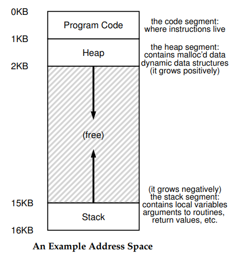

# Reserva dinamica de memoria


## 1. Introducción

Este documento tiene como objetivo proporcionar una base teórica sobre la gestión de memoria dinámica en el lenguaje de programación C. A diferencia de lenguajes de alto nivel como Java o Python, que emplean mecanismos automáticos de gestión de memoria (e.g., Garbage Collector), C delega esta responsabilidad directamente al programador. La gestión manual de memoria es una característica fundamental del lenguaje que permite un control granular sobre los recursos del sistema, posibilitando la creación de aplicaciones de alto rendimiento y estructuras de datos de tamaño variable, cuyo dimensionamiento no se conoce en tiempo de compilación.

## 2. Conceptos importantes

### 2.1. Mapa de memoria


El **mapa de memoria** es una representación que muestra cómo está organizada y distribuida la memoria. En la siguiente figura se muestra el mapa de memoria asociado al espacio de direcciones (memoria virtual) de un proceso:

<p align = "center">

</p>

Este mapa de memoria virtual se organiza típicamente en tres segmentos principales tal y como se resume en la siguiente tabla:

|Región|Contenido|Vida / gestión|Crecimiento |Uso típico en C|
|---|---|---|---|---|
|Code segment (Program Code)|Instrucciones del programa (código)|Cargado por el SO al iniciar; tamaño fijo|Estático (no crece)|Ejecutar funciones y rutinas|
|Heap segment|Memoria dinámica gestionada por el usuario (p. ej., `malloc`) y estructuras dinámicas|Crece/encoge durante la ejecución; lo gestiona el programa con `malloc` / `calloc` / `realloc` / `free` | Crece en dirección opuesta al stack (positivamente) |Arreglos/estructuras dinámicas, buffers|
|Stack segment|Variables locales, parámetros, valores de retorno, frames de llamadas|Administrado automáticamente por llamadas/retornos; una pila por hilo|Crece en dirección opuesta al heap (negativamente)|Variables automáticas, paso de argumentos|

Comprender el mapa de memoria en C es fundamental, dado que la administración de memoria recae explícitamente en el programador. Distinguir entre **stack** (almacenamiento automático), **heap** (asignación dinámica mediante malloc/realloc/free) y **segmento estático** permite definir con precisión la vida útil y el alcance de los datos, establecer con claridad la propiedad de la memoria (quién asigna y quién libera) y prevenir fallos críticos como fugas, *double free*, *use-after-free* y desbordamientos, todos ellos asociados al comportamiento indefinido.

Adicionalmente, el conocimiento de la ubicación y naturaleza de cada región favorece decisiones de eficiencia (mejor localidad de caché, reducción de fragmentación y de llamadas innecesarias a asignadores) y una depuración más rigurosa al correlacionar errores con su origen. En suma, el mapa de memoria proporciona el marco conceptual para asignar, utilizar y liberar recursos de forma correcta, segura y performante, condición indispensable para el desarrollo de software de sistemas en C.

### 2.2. Manejo de memoria en C

En Java/Python existe recolección de basura (GC); en C al ser el programador quien administra la memoria. Este tiene que tener en cuenta dos responsabilidades clave:
* **Reservar explícitamente** (p. ej., malloc, calloc) y liberar (free).
* **Evitar comportamiento indefinido**: usar memoria no inicializada, acceder fuera de límites, hacer double free, etc.

Para interactuar con el `heap`, es necesario incluir `<stdlib.h>`. La siguiente tabla resume las funciones principales:

Estas son las cuatro principales:

|Función|Sintaxis|Propósito Principal|
|---|---|---|
|`malloc`|`void *malloc(size_t size);`| Permite reservar un bloque de memoria (sin inicializar) en el heap. |
|`calloc`|`void *calloc(size_t nmemb, size_t size);`|Permiter reservar e inicializar a 0 un bloque de memoria de nmemb × size (útil para structs/arreglos).|
|`realloc`| `void *realloc(void *ptr, size_t new_size);` | Permite redimensionar un bloque de memoria ya existente |
|`free`|`void free(void *ptr);`|Permite liberar un bloque de memoria para devolverlo al sistema.|

Además de las funciones para asignar y liberar memoria, se emplean otras funciones de la biblioteca <string.h> para manipular bloques de memoria a nivel de bytes. Estas son esenciales para copiar, comparar o inicializar la memoria que ha sido previamente reservada.

| Función | Sintaxis| Propósito Principal|Aspectos a tener en cuenta|
|---|---|---|---|
|`memset`|`void* memset(void* ptr, int value, size_t num);`|Rellenar un bloque de memoria con un valor específico (byte a byte).|Ideal para inicializar o "limpiar" un bloque. `memset(buffer, 0, 100)`; pone 100 bytes del buffer a cero.|
|`memcpy`|`void* memcpy(void* dest, const void* src, size_t num);`| Copiar `num` bytes desde un origen (`src`) a un destino (`dest`).|Es muy rápida, pero las zonas de memoria no deben solaparse. Si lo hacen, el resultado es indefinido.|
|`memmove`|`void* memmove(void* dest, const void* src, size_t num);`|Mover `num` bytes de `src` a `dest` de forma segura.|La versión segura de `memcpy`. Funciona correctamente incluso si las zonas de memoria se solapan, aunque puede ser ligeramente más lenta|
|`memcmp`|`int memcmp(const void* ptr1, const void* ptr2, size_t num);`|Comparar los primeros num bytes de dos bloques de memoria.|Devuelve 0 si son idénticos, <0 si el primero es menor, o >0 si el primero es mayor.|

### 2.3. Buenas practicas

A continuación se muestra una lista de buenas prácticas para el manejo de memoria dinámica en C:

1. **Verifique que la asignación de memoria fue correcta**: Después de una llamada a `malloc`, `calloc` o `realloc`, comprueba si el puntero devuelto es `NULL`. Esto indica que el sistema no pudo asignar la memoria solicitada.
   
   ```c
   #include <stdio.h>
   #include <stdlib.h>

   int* ptr = (int*) malloc(10 * sizeof(int));
   if (ptr == NULL) {
      // Validar el puntero retornado por malloc.
      // Notificar el error y terminar la ejecución de forma controlada.
      fprintf(stderr, "Error: Fallo en la asignación de memoria.\n");
      exit(EXIT_FAILURE);
   }
   ```

2. **Evite punteros polgantes (Dangling Pointers) asignando `NULL` despues de librerar memoria**: Una vez que se libera la memoria con `free`, el puntero todavía apunta a esa ubicación ahora inválida. Asignarle `NULL` previene su uso accidental posterior.
   
   ```c
   int* ptr = (int*) malloc(sizeof(int));
   if (ptr == NULL) { /* ... */ }

   *ptr = 123;
   printf("Valor del dato: %d\n", *ptr);

   // Liberar el recurso de memoria.
   free(ptr);
   // Asignar NULL para invalidar el puntero y prevenir su uso posterior.
   ptr = NULL;
   ```

3. **Use un puntero temporal para `realloc`**: Nunca asigne el resultado de realloc directamente al puntero original. Si `realloc` falla, devolverá `NULL` y se perderá la referencia a la memoria original, causando una fuga de memoria.
   
   ```c
   int* arr = (int*) malloc(5 * sizeof(int));
   if (arr == NULL) { /* ... */ }

   // ... Utilización del arreglo ...

   // Asignar el resultado de realloc a un puntero temporal.
   int* temp = (int*) realloc(arr, 10 * sizeof(int));
   if (temp == NULL) {
      // Si la reasignación falla, temp es NULL, pero 'arr' conserva la dirección original.
      fprintf(stderr, "Error al intentar redimensionar el bloque de memoria.\n");
      // Liberar el bloque de memoria original antes de manejar el error.
      free(arr);
      exit(EXIT_FAILURE);
   }

   // Si la operación es exitosa, se actualiza el puntero original.
   arr = temp;
   ```

4. **Encapsulación de la Gestión de Memoria (Funciones Simétricas)**: Para estructuras de datos complejas, es un patrón de diseño robusto encapsular la gestión de su ciclo de vida. Se debe proveer una función "constructora" que asigne e inicialice todos los recursos necesarios, y una función "destructora" simétrica que libere dichos recursos en el orden inverso a su asignación. Este enfoque define claramente la propiedad (ownership) de la memoria.
   
   ```c
   typedef struct {
      int id;
      int* data;
   } MyObject;

   // Función constructora: asigna e inicializa los recursos del objeto.
   MyObject* create_object(size_t data_size) {
      MyObject* obj = (MyObject*) malloc(sizeof(MyObject));
      if (obj == NULL) return NULL;

      obj->data = (int*) calloc(data_size, sizeof(int));
      if (obj->data == NULL) {
         // En caso de fallo en la asignación interna, liberar recursos previamente asignados.
         free(obj);
         return NULL;
      }
      obj->id = 1;
      return obj;
   }

   // Función destructora: libera los recursos del objeto.
   void destroy_object(MyObject* obj) {
      if (obj != NULL) {
         free(obj->data);   // Liberación de recursos internos.
         free(obj);         // Liberación del contenedor principal.
      }
   }

   // Uso del patrón:
   MyObject* my_obj = create_object(20);
   // ... Utilización del objeto ...
   destroy_object(my_obj);
   ```

## 3. Actividad

Descargue el archivo [dynamic_mem_examples.zip](dynamic_mem_examples.zip), descomprimalo e ingrese al directorio resultante:

```bash
cd dynamic_mem_examples
```

Una vez allí, liste los archivos en este directorio y verifique que se encuentre el archivo `Makefile`:

```bash
ls
```

Luego, compile y genere los ejecutables mediante el siguiente comando:

```bash
make
```

Si todo sale bien, por cada archivo fuente (`.c`) se genera un archivo ejecutable cuyo nombre será el mismo del archivo fuente si na extención. 

Para ejecutar los ejemplos use el nombre del archivo resultante al compilar sin tener en cuenta la extención (`.c`). Por ejemplo, si el archivo se llama `ejemplo.c`, para ejecutar el archivo generado por el makefile use el siguiente comando comando:

```bash
./ejemplo
```

## 5. Ejemplos

Analice y ejecute la siguiente lista de ejemplos:

1. [dynamic_array01.c](#ejemplo-1)
2. [dynamic_array02.c](#ejemplo-2)
3. [dynamic_array03.c](#ejemplo-3)
4. [dynamic_array04.c](#ejemplo-4)
5. [dynamic_array05.c](#ejemplo-5)
6. [dynamic_array06.c](#ejemplo-6)
7. [dynamic_array07.c](#ejemplo-7)
8. [dynamic_array_inclass.c](#ejemplo-8)
9. [linked_list.c](#ejemplo-1)
10. [linked_list_inclass.c](#ejemplo-1)
11. [sizeof_arrays.c](#ejemplo-1)

### Ejemplo 1

**Archivo**: [dynamic_array01.c](dynamic_array01.c)

```c
/*
Author: Adalbert Gerald Soosai Raj
URL: https://pages.cs.wisc.edu/~gerald/cs354/Spring2019/code/lecture04/dynamic_array01.c
*/

#include <stdio.h>
#include <stdlib.h>

int main(int argc, char *argv[]) {
    if (argc != 2) {
        fprintf(stderr, "USAGE: %s <num_elems>\n", argv[0]);
		exit(1);
    }

    int num = atoi(argv[1]);
    printf("num = %d\n", num);

	// create a variable length array (vla)
    int a[num];

    for (int i = 0; i < num; ++i) {
        a[i] = 0;
    }

    for (int i = 0; i < num; ++i) {
        printf("a[%d] = %d\n", i, a[i]);
    }

    return 0;
}
```

Para ejecutar use el comando:

```
./dynamic_array01
```

### Ejemplo 2

**Archivo**: [dynamic_array02.c](dynamic_array02.c)

```c
/*
Author: Adalbert Gerald Soosai Raj
URL: https://pages.cs.wisc.edu/~gerald/cs354/Spring2019/code/lecture04/dynamic_array02.c
*/

#include <stdio.h>
#include <stdlib.h>

int main(int argc, char *argv[]) {
    if (argc != 2) {
        fprintf(stderr, "USAGE: %s <num_elems>\n", argv[0]);
        exit(1);
    }

    int num = atoi(argv[1]);
    printf("num = %d\n", num);

    // create a dynamic array on the heap 
    int *a = malloc(num * sizeof(int));

    if (a == NULL) {
        fprintf(stderr, "Memory allocation failed.\n");
        exit(1);
    }

    for (int i = 0; i < num; ++i) {
        a[i] = 0;
    }

    for (int i = 0; i < num; ++i) {
        printf("a[%d] = %d\n", i, a[i]);
    }

    free(a);

    return 0;
}
```

Para ejecutar use el comando:

```
./dynamic_array02
```

### Ejemplo 3

**Archivo**: [dynamic_array03.c](dynamic_array03.c)

```c
/*
Author: Adalbert Gerald Soosai Raj
URL: https://pages.cs.wisc.edu/~gerald/cs354/Spring2019/code/lecture04/dynamic_array03.c
*/

#include <stdio.h>
#include <stdlib.h>

int main(int argc, char *argv[]) {
    if (argc != 2) {
        fprintf(stderr, "USAGE: %s <num_elems>\n", argv[0]);
        exit(1);
    }

    int num = atoi(argv[1]);
    printf("num = %d\n", num);

    // create a dynamic array on the heap 
    // clear all the memory to zeros.
    int *a = calloc(num, sizeof(int));

    if (a == NULL) {
        fprintf(stderr, "Memory allocation failed.\n");
        exit(1);
    }

    for (int i = 0; i < num; ++i) {
        printf("a[%d] = %d\n", i, a[i]);
    }

    free(a);

    return 0;
}
```

Para ejecutar use el comando:

```
./dynamic_array03
```

### Ejemplo 4

**Archivo**: [dynamic_array04.c](dynamic_array04.c)

```c
/*
Author: Adalbert Gerald Soosai Raj
URL: https://pages.cs.wisc.edu/~gerald/cs354/Spring2019/code/lecture04/dynamic_array04.c
*/

#include <stdio.h>
#include <stdlib.h>

int main(int argc, char *argv[]) {
    if (argc != 2) {
        fprintf(stderr, "USAGE: %s <num_elems>\n", argv[0]);
        exit(1);
    }

    int num = atoi(argv[1]);
    printf("num = %d\n", num);

    // create a dynamic array on the heap.
    int *a = malloc(num * sizeof(int));

    if (a == NULL) {
        fprintf(stderr, "Memory allocation failed.\n");
        exit(1);
    }

    for (int i = 0; i < num; ++i) {
        a[i] = i;
    }

    for (int i = 0; i < num; ++i) {
        printf("a[%d] = %d\n", i, a[i]);
    }

    // Question: is there a problem below?
    // Need double the size of the original array.
    printf("Resize array:\n");
    a = malloc(2 * num * sizeof(int));

    for (int i = 0; i < 2 * num; ++i) {
        printf("a[%d] = %d\n", i, a[i]);
    }


    free(a);

    return 0;
}
```

Para ejecutar use el comando:

```
./dynamic_array04
```

### Ejemplo 5

**Archivo**: [dynamic_array05.c](dynamic_array05.c)

```c
/*
Author: Adalbert Gerald Soosai Raj
URL: https://pages.cs.wisc.edu/~gerald/cs354/Spring2019/code/lecture04/dynamic_array05.c
*/

#include <stdio.h>
#include <stdlib.h>

int main(int argc, char *argv[]) {
    if (argc != 2) {
        fprintf(stderr, "USAGE: %s <num_elems>\n", argv[0]);
        exit(1);
    }

    int num = atoi(argv[1]);
    printf("num = %d\n", num);

    // create a dynamic array on the heap.
    int *a = malloc(num * sizeof(int));

    if (a == NULL) {
        fprintf(stderr, "Memory allocation failed.\n");
        exit(1);
    }

    for (int i = 0; i < num; ++i) {
        a[i] = i;
    }

    for (int i = 0; i < num; ++i) {
        printf("a[%d] = %d\n", i, a[i]);
    }

    printf("Resize array:\n");
    // Need double the size of the original array.
    int *p = malloc(2 * num * sizeof(int));

    for (int i = 0; i < num; ++i) {
        p[i] = a[i];
    }

    free(a);

    for (int i = 0; i < 2 * num; ++i) {
        printf("a[%d] = %d\n", i, a[i]);
    }

    free(p);

    return 0;
}
```

Para ejecutar use el comando:

```
./dynamic_array05
```

### Ejemplo 6

**Archivo**: [dynamic_array06.c](dynamic_array06.c)

```c
/*
Author: Adalbert Gerald Soosai Raj
URL: https://pages.cs.wisc.edu/~gerald/cs354/Spring2019/code/lecture04/dynamic_array06.c
*/

#include <stdio.h>
#include <stdlib.h>

int main(int argc, char *argv[]) {
    if (argc != 2) {
        fprintf(stderr, "USAGE: %s <num_elems>\n", argv[0]);
        exit(1);
    }

    int num = atoi(argv[1]);
    printf("num = %d\n", num);

    // create a dynamic array on the heap.
    int *a = malloc(num * sizeof(int));

    if (a == NULL) {
        fprintf(stderr, "Memory allocation failed.\n");
        exit(1);
    }

    for (int i = 0; i < num; ++i) {
        a[i] = i;
    }

    for (int i = 0; i < num; ++i) {
        printf("a[%d] = %d\n", i, a[i]);
    }

    printf("Resize array:\n");
    // Need double the size of the original array.
    a = realloc(a, 2 * num * sizeof(int));

    for (int i = 0; i < 2 * num; ++i) {
        printf("a[%d] = %d\n", i, a[i]);
    }

    free(a);

    return 0;
}
```

Para ejecutar use el comando:

```
./dynamic_array06
```

### Ejemplo 7

**Archivo**: [dynamic_array07.c](dynamic_array07.c)

```c
/*
Author: Adalbert Gerald Soosai Raj
URL: https://pages.cs.wisc.edu/~gerald/cs354/Spring2019/code/lecture04/dynamic_array07.c
*/

#include <stdio.h>
#include <stdlib.h>

#define ROWS 3
#define COLS 3

int** transpose(int a[][COLS]) {
    int **p = malloc(ROWS * sizeof(int *));
    for (int i = 0; i < ROWS; ++i) {
        p[i] = malloc(COLS * sizeof(int));
    }

    for (int i = 0; i < ROWS; ++i) {
        for (int j = 0; j < COLS; ++j) {
            // p[i][j] = a[j][i];
            *(*(p + i) + j) = a[j][i];
        }
    }
    return p;
}

int main() {
    int a[ROWS][COLS] = {{1, 2, 3}, {4, 5, 6}, {7, 8, 9}};
    for (int i = 0; i < ROWS; ++i) {
        for (int j = 0; j < COLS; ++j) {
            printf("a[%d][%d] = %d\t", i, j, a[i][j]);
        }
        printf("\n");
    }
    int **t = transpose(a);
    for (int i = 0; i < ROWS; ++i) {
        for (int j = 0; j < COLS; ++j) {
            printf("t[%d][%d] = %d\t", i, j, t[i][j]);
        }
        printf("\n");
    }
    // TODO: free the 2d array.
    return 0;
}
```

Para ejecutar use el comando:

```
./dynamic_array07
```

### Ejemplo 8

**Archivo**: [dynamic_array_inclass.c](dynamic_array_inclass.c)

```c
/*
Author: Adalbert Gerald Soosai Raj
URL: https://pages.cs.wisc.edu/~gerald/cs354/Spring2019/code/lecture04/dynamic_array_inclass.c
*/

#include <stdio.h>
#include <stdlib.h>

int main(int argc, char *argv[]) {
    if (argc != 2) {
        fprintf(stderr, "USAGE: %s <num_elems>\n", argv[0]);
        exit(1);
    }

    int num = atoi(argv[1]);
    printf("num = %d\n", num);

    // create a dynamic array on the heap 
    int *a = malloc(num * sizeof(int));

    if (a == NULL) {
        fprintf(stderr, "Memory allocation failed.\n");
        exit(1);
    }

    for (int i = 0; i < num; ++i) {
        a[i] = i;
    }

    for (int i = 0; i < num; ++i) {
        printf("a[%d] = %d\n", i, a[i]);
    }

    a = realloc(a, 2 * num * sizeof(int));

    for (int i = 0; i < 2 * num; ++i) {
        printf("a[%d] = %d\n", i, a[i]);
    }

    free(a);

    free(a);

    return 0;
}
```

Para ejecutar use el comando:

```
./dynamic_array_inclass
```

### Ejemplo 9

**Archivo**: [linked_list.c](linked_list.c)

```c
/*
Author: Adalbert Gerald Soosai Raj
URL: https://pages.cs.wisc.edu/~gerald/cs354/Spring2019/code/lecture04/linked_list.c
*/

#include <assert.h>
#include <stdlib.h>
#include <stdio.h>

struct node {
    int data;
    struct node * next;
};

void print_list(struct node *head);
struct node * insert_at_end(struct node *head, int data);
int delete_at_front(struct node **phead); 
 
int main() {
    struct node * head = NULL;
    print_list(head);
    head = insert_at_end(head, 10);
    print_list(head);
    head = insert_at_end(head, 20);
    print_list(head);
    head = insert_at_end(head, 30);
    print_list(head);
    delete_at_front(&head);
    print_list(head);
    delete_at_front(&head);
    print_list(head);
    delete_at_front(&head);
    print_list(head);
    return 0;
}

int delete_at_front(struct node **phead) {
    struct node * first = *phead;
    assert(first != NULL);
    *phead = first->next;
    int data = first->data;
    free(first);
    return data;
}

struct node * insert_at_end(struct node *head, int data) {
    // create a new node.
    struct node * new_node = malloc(sizeof(struct node));
    assert(new_node != NULL);
    new_node->data = data;
    new_node->next = NULL;

    // list is empty.
    if (head == NULL) {
        head = new_node;
        return head;    
    }

    // list has some elements already.
    struct node *current = head;
    while (current->next != NULL) {
        current = current->next;
    }

    current->next = new_node;
    return head;
}

void print_list(struct node *head) {
    struct node * current = head;
    if (current == NULL) {
        printf("Empty list.\n");
        return;
    } else {
        while (current) {
            printf("|%d|%p| -> ", current->data, current->next);
            current = current->next;
        } 
        printf("\n");
    } 
}
```

Para ejecutar use el comando:

```
./linked_list
```

### Ejemplo 10

**Archivo**: [linked_list_inclass.c](linked_list_inclass.c)

```c
/*
Author: Adalbert Gerald Soosai Raj
URL: https://pages.cs.wisc.edu/~gerald/cs354/Spring2019/code/lecture04/linked_list_inclass.c
*/

#include <assert.h>
#include <stdlib.h>
#include <stdio.h>

struct node {
    int data;
    struct node * next;
};

struct node* insert_at_end(struct node* head, int data) {
    struct node *new_node = malloc(sizeof(struct node));
    new_node->data = data;
    new_node->next = NULL;

    if (head == NULL) {
        return new_node;
    }

    struct node *curr = head;
    while (curr->next != NULL) {
        curr = curr->next;
    }

    curr->next = new_node;
    return head;
}

void print_list(struct node *head) {
    while (head != NULL) {
        printf("|%d|%p| -> ", head->data, head->next);
        head = head->next;
    }
    printf("\n");
}

void delete_at_begin(struct node **phead) {
    struct node *first = *phead;
    *phead = (*phead)->next;
    free(first);
}

void addOne(int *pn) {
    *pn = *pn + 1;
}

int main() {
    int n = 100;
    addOne(&n);
    printf("n = %d\n", n);

    struct node * head = NULL;
    head = insert_at_end(head, 10);
    print_list(head);
    head = insert_at_end(head, 20);
    print_list(head);
    head = insert_at_end(head, 30);
    print_list(head);
    delete_at_begin(&head);
    print_list(head);
    delete_at_begin(&head);
    print_list(head);
    delete_at_begin(&head);
    print_list(head);
    return 0;
}
```

Para ejecutar use el comando:

```
./linked_list_inclass
```

### Ejemplo 11

**Archivo**: [sizeof_arrays.c](sizeof_arrays.c)

```c
/*
Author: Adalbert Gerald Soosai Raj
URL: https://pages.cs.wisc.edu/~gerald/cs354/Spring2019/code/lecture04/sizeof_arrays.c
*/

#include <stdio.h>
#include <stdlib.h>

int main(int argc, char *argv[]) {
    int a[100];
    int *p = malloc(sizeof(int) * 100);
    printf("size of a = %d\n", sizeof(a));
    printf("size of p = %d\n", sizeof(p));
    return 0;
}
```

Para ejecutar use el comando:

```
./sizeof_arrays
```

## Referencias teoricas

A continuación se muestran algunos apuntes de clase que ilustran algunos conceptos teoricos necesarios para comprender la lista de ejemplos adjuntos:

* **Apuntadores y arreglos** [[link]](https://udea-so.github.io/intro-c/content/CH_02-S02.html)
* **Apuntadores y arreglos multidimensionales** [[link]](https://udea-so.github.io/intro-c/content/CH_02-S03.html)
* **Estructuras en C** [[link]](https://udea-so.github.io/intro-c/content/CH_02-S04.html)
* **Memoria dinámica en C** [[link]](https://udea-so.github.io/intro-c/content/CH_02-S05.html)
* **Dynamic Memory Allocation** [[link]](https://diveintosystems.org/book/C2-C_depth/dynamic_memory.html)

## Referencias

* https://skills.microchip.com/page/c-programming
* https://diveintosystems.org/book/C2-C_depth/dynamic_memory.html
* https://skills.microchip.com/fundamentals-of-the-c-programming-language-part-i
* https://skills.microchip.com/fundamentals-of-the-c-programming-language-part-ii
* https://skills.microchip.com/fundamentals-of-the-c-programming-language-part-iii

> [!Note]
> **AI Disclosure:** This document was created with the assistance of Artificial Intelligence language models. The content has been reviewed, edited, and validated by a human author to ensure accuracy and quality.

[⬆️ Subir un nivel](../)