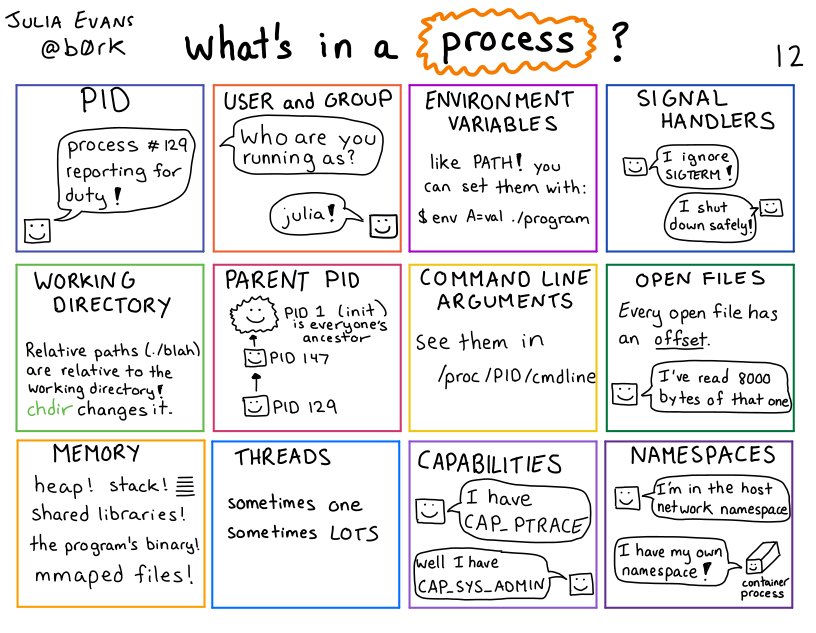
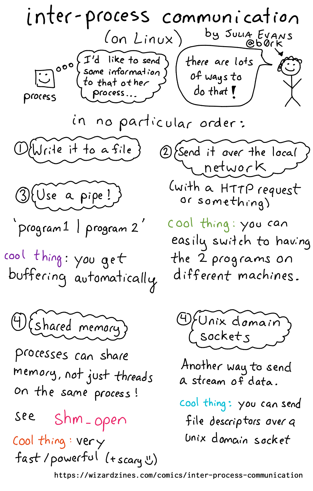
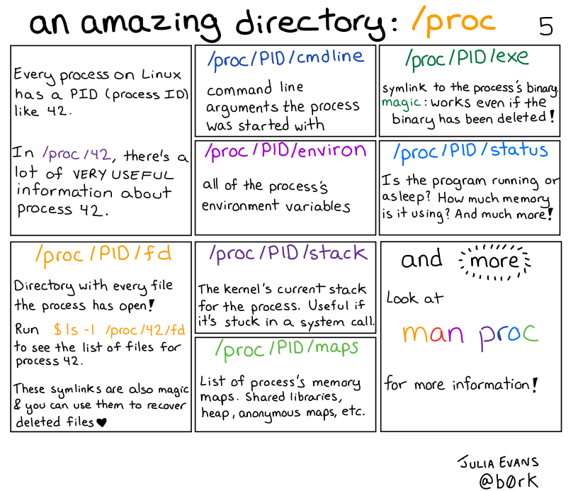

# Procesos

## 1. Contextualización

La siguiente caricatura de Julia Evans ([link](https://wizardzines.com/comics/processes/)) explica que es un proceso resumiendo todo lo que se ha tratado a lo largo del curso se Sistemas Operativos que este relacionado con este tema:

<p align="center">
  
</p>


Para interactuar entre sí, los procesos se comunican de diferentes maneras, esto se conoce en la literatura como IPC (Comunicación entre procesos). La siguiente figura de Julia Evans ([link](https://wizardzines.com/comics/inter-process-communication/)) explica esto mejor que lo que lo podríamos hacer en clase:

<p align="center">
  
</p>

Para ver información sobre procesos que se están ejecutando en el SO (workload) Linux proporciona un directorio conocido como `/proc`. Conocer un poco más sobre este directorio y su importancia es de vital importancia. Para esto, la siguiente caricatura de Julia Evans ([link](https://wizardzines.com/comics/proc/)) puede ser un buen punto de partida:

<p align="center">
  
</p>

Para profundizar más, se recomienda que revise la página **What happens when you start a process on Linux?** ([link](https://jvns.ca/blog/2016/10/04/exec-will-eat-your-brain/)) de la misma autora.


Gestión de Procesos bajo el Estándar POSIX

## 2. Introducción a la Gestión de Procesos

En el dominio de los Sistemas Operativos, un **proceso** se define como una instancia de un programa en ejecución. La capacidad del sistema para gestionar múltiples procesos de forma concurrente es un pilar fundamental de la computación moderna, permitiendo la multiprogramación y el paralelismo.

El estándar **POSIX (Portable Operating System Interface)** especifica una interfaz de programación de aplicaciones (API) diseñada para maximizar la portabilidad de software entre distintos sistemas operativos de la familia UNIX, incluyendo Linux y macOS. Dicha API provee un conjunto de llamadas al sistema (system calls) que exponen funcionalidades del kernel al espacio de usuario, permitiendo a los programadores ejercer un control preciso sobre el ciclo de vida de los procesos.

El dominio de estas llamadas al sistema es un requisito indispensable para el desarrollo de software de sistema avanzado, tal como shells de comandos, compiladores, demonios de servicio o cualquier aplicación que requiera la orquestación de tareas concurrentes. La siguiente tabla ofrece una sinopsis de las funciones fundamentales que serán objeto de estudio en las prácticas de laboratorio.


## 3. Sinopsis de la API de Procesos POSIX

A continuación, se presenta una tabla que resume las llamadas al sistema esenciales para la creación, ejecución y sincronización de procesos. Es imperativo que cada estudiante comprenda la semántica de estas funciones antes de proceder con la implementación de los ejemplos prácticos.

| Función (Prototipo en C) | Cabecera Requerida | Descripción Técnica |
| :----------------------- | :----------------- | :------------------ |
| `pid_t fork(void);` | `#include <unistd.h>` | **Creación de Proceso:** Genera un nuevo proceso, denominado hijo, mediante la duplicación del espacio de direcciones del proceso invocador, denominado padre. La función retorna el identificador del proceso (PID) hijo en el padre, `0` en el proceso hijo, y `-1` en caso de error. |
| `pid_t getpid(void);` | `#include <unistd.h>` | **Identificación de Proceso:** Retorna el identificador (PID) del proceso que ejecuta la llamada. Este PID es un valor entero único asignado por el kernel durante la creación del proceso. |
| `pid_t getppid(void);`| `#include <unistd.h>` | **Identificación de Proceso Padre:** Retorna el PID del proceso padre del proceso actual. Esta función permite la navegación ascendente en la jerarquía de procesos. |
| `int exec...();` | `#include <unistd.h>` | **Ejecución de un Nuevo Programa:** Reemplaza la imagen del proceso actual con una nueva imagen de proceso, cargada desde un fichero ejecutable. La familia de funciones `exec` (`execlp`, `execvp`, etc.) varía en la forma de especificar el fichero y sus argumentos. Si la llamada es exitosa, no hay valor de retorno, ya que el código del proceso original es reemplazado. |
| `pid_t wait(int *status);` | `#include <sys/wait.h>` | **Sincronización Padre-Hijo:** Suspende la ejecución del proceso padre hasta que uno de sus procesos hijos haya finalizado. Permite al padre obtener el estado de terminación del hijo y libera los recursos del hijo en la tabla de procesos del kernel, evitando la generación de procesos *zombie*. |
| `pid_t waitpid(pid_t pid, int *status, int options);` | `#include <sys/wait.h>` | **Sincronización Selectiva:** Constituye una generalización de `wait()`. Permite al padre esperar por un proceso hijo específico, o por cualquier hijo de un grupo de procesos. Admite opciones para modificar su comportamiento, como la operación no bloqueante. |
| `void exit(int status);`| `#include <stdlib.h>` | **Terminación de Proceso:** Finaliza la ejecución del proceso invocador de forma controlada. El argumento `status` es un código de salida entero que es puesto a disposición del proceso padre a través de las llamadas `wait()` o `waitpid()`. |

## 3. Patrón de Uso Común: `fork`-`exec`-`wait`

La combinación de las llamadas `fork()`, `exec()` y `wait()` constituye el paradigma fundamental para la creación y gestión de nuevos procesos en sistemas POSIX. Este patrón es la base sobre la cual se construyen los intérpretes de comandos (shells) y otras aplicaciones que delegan tareas a programas externos.

El flujo canónico es el siguiente:
1.  **bifurcación (`fork`)**: Un proceso padre invoca a `fork()` para crear un nuevo proceso hijo. Este es una réplica del padre, con su propio espacio de direcciones, pero compartiendo el mismo código.
2.  **Ejecución (`exec`)**: El proceso hijo utiliza una de las funciones de la familia `exec()` para reemplazar su imagen de proceso por la de un nuevo programa. Esta acción transforma al hijo en un nuevo programa sin cambiar su PID.
3.  **Espera (`wait`)**: El proceso padre invoca a `wait()` o `waitpid()` para suspender su propia ejecución hasta que el proceso hijo finalice. Esto no solo sincroniza ambos procesos, sino que también permite al padre recuperar el estado de terminación del hijo y asegura que el sistema operativo libere todos los recursos asociados al mismo.

El siguiente diagrama permite tener una visualización general patron `fork-exec-wait`:

```
 [ Proceso Padre ]
              |
              | Acción: Ejecuta código inicial
              |
              +------------------ fork() ------------------+
              |                                            |
              V                                            V
      [ Padre (continúa) ]                         [ Hijo (nuevo proceso) ]
              |                                            |
              | Acción: Código post-fork                   | Acción: Código post-fork
              |                                            |
              V                                            V
      [ Estado: BLOQUEADO en wait() ]              Acción: Llama a exec(...)
              |                                            |
              |                                            |
              |                                      [ Proceso se transforma ]
              |                                      [ en el nuevo programa  ]
              |                                            |
              |                                            | Acción: Ejecuta el nuevo código
              |                                            |
              |<----------- Señal de terminación <----------+ (El hijo termina)
              |
              V
      [ Padre (reanudado) ]
              |
              | Acción: Procesa el estado del hijo
              |
              V
      [ Padre (continúa ejecución) ]
              |
              V
      [ Padre (termina) ]
```

### 3.1. Plantilla de Código Comentada

El siguiente código fuente en C provee una implementación de referencia del patrón descrito. Para este caso, un proceso padre crea un hijo, el cual ejecuta el comando `ls -l`, mientras el padre espera su finalización.

```c
/**
 * @file process_template.c
 * @brief Implementación canónica del patrón fork-exec-wait.
 * @author Tu Nombre/Institución
 * @date 2025-09-25
 *
 * Compilación: gcc -Wall -Wextra -std=c11 -o process_template process_template.c
 */

#include <stdio.h>      // Para E/S estándar (printf, fprintf)
#include <stdlib.h>     // Para control de procesos (exit, EXIT_SUCCESS, EXIT_FAILURE)
#include <unistd.h>     // Para la API de POSIX (fork, getpid, getppid, execlp)
#include <sys/wait.h>   // Para la llamada wait() y macros asociadas (WIFEXITED, WEXITSTATUS)

/**
 * @brief Función principal que demuestra el ciclo de vida de un proceso.
 * @return Retorna EXIT_SUCCESS en caso de éxito, EXIT_FAILURE en caso de error.
 */
int main(void) {
    pid_t child_pid;

    // -- Bifurcación del Proceso --
    child_pid = fork();

    // -- Manejo de Errores de fork() --
    if (child_pid == -1) {
        perror("fork"); // Imprime un mensaje de error descriptivo
        exit(EXIT_FAILURE);
    }

    // -- Bloque de Ejecución del Proceso Hijo --
    if (child_pid == 0) {
        printf("[Hijo, PID: %d] Proceso hijo en ejecución. PPID: %d.\n", getpid(), getppid());
        
        // -- Recubrimiento con un Nuevo Programa --
        // Se ejecuta 'ls -l'. execlp busca 'ls' en las rutas definidas por la variable de entorno PATH.
        execlp("ls", "ls", "-l", (char *)NULL);

        // Si la llamada a execlp es exitosa, este punto del código es inalcanzable.
        // Si se alcanza, indica un error en la ejecución.
        perror("execlp");
        exit(EXIT_FAILURE);
    } 
    // -- Bloque de Ejecución del Proceso Padre --
    else {
        printf("[Padre, PID: %d] Proceso hijo creado con PID: %d.\n", getpid(), child_pid);
        
        int wstatus;
        
        // -- Sincronización: Espera de la Terminación del Hijo --
        wait(&wstatus);
        
        printf("[Padre, PID: %d] El proceso hijo ha finalizado.\n", getpid());
        
        // -- Análisis del Estado de Terminación del Hijo --
        if (WIFEXITED(wstatus)) {
            printf("[Padre, PID: %d] El hijo terminó normalmente con estado: %d.\n", getpid(), WEXITSTATUS(wstatus));
        } else {
            printf("[Padre, PID: %d] El hijo terminó de forma anormal.\n", getpid());
        }
    }

    exit(EXIT_SUCCESS);
}
```

### 3.2. Compilación y Ejecución
Para compilar y ejecutar el código anterior, utilice los siguientes comandos en una terminal de sistema tipo UNIX:

```
# Compilar el código fuente en un fichero ejecutable llamado 'proceso_template'
gcc -o proceso_template proceso_template.c

# Ejecutar el programa compilado
./proceso_template
```

## 4. Ejemplos

## Ejemplos

Como material de apoyo para el desarrollo de la practica se proporcionan varios ejemplos. Estudielos y comprenda lo que hacen y una vez que tenga claros los conceptos empiece a programar la practica.
1. **Ejemplos clave**: Estos ejemplos contienen los principales aspectos que se tienen que tener en cuenta para iniciar la practica. [[link]](./examples/clave/)
2. **Ejemplos del curso**: Una recopilación de ejemplos antiguos para comprender algunas funciones del API de procesos de Posix. [[link]](./examples/curso/)
3. **Ejemplo del libro de Remzi**: Ejemplos del capitulo **Interlude: Process API** del libro de Remzi. [[link]](./examples/remzi/)


