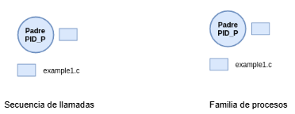
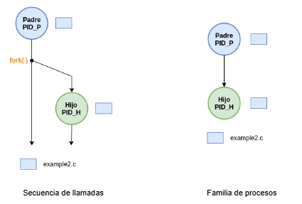
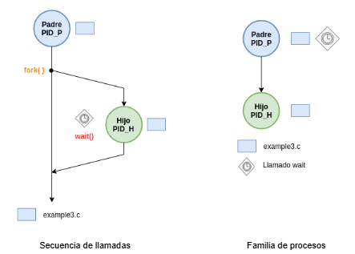
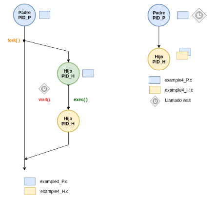

# Ejemplos 1

## Introducción

Los ejemplos que aqui se muestran son tomados del tutorial de **Procesos** ([link](https://udea-so.github.io/udea-so/docs/laboratorio/tutoriales/procesos/#31-ejemplos-basicos)) del curso. 

Antes de empezar el laboratorio; compile, ejecute y entienda los códigos de la sección **3.1. Ejemplos basicos** ([link](https://udea-so.github.io/udea-so/docs/laboratorio/tutoriales/procesos/#31-ejemplos-basicos)) usando como guia el tutorial.

Por comodidad, se colocan nuevamente a continuación.

## Ejemplos

1. Hacer un programa que despliegue el PID de un proceso. Adicionalmente el programa deberá aumentar cada segundo una variable en el rango 0 a 2.
   
   <p align="center">
     
   </p>


   **Archivos**: [example1.c](example1.c)

   **Compilación**:

   ```
   gcc -Wall example1.c -o example1.out
   ```

   **Ejecución**

   ```
   ./example1.out
   ```

2. Hacer un programa que genere dos procesos. Por un lado el proceso padre, el cual contará en el rango 0 a 2 cada segundo; por otro lado el proceso hijo, el cual contará también cada segundo números dentro del rango 0 a (2 + 3), es decir, 0 a 5. El programa padre no esperará a que el hijo culmine en caso de acabar primero.
   
   <p align="center">
     
   </p>

   **Archivos**: [example2.c](example2.c)

   **Compilación**:

   ```
   gcc -Wall example2.c -o example2.out
   ```

   **Ejecución**

   ```
   ./example2.out
   ```

3. Hacer un programa que genere dos procesos. Por un lado el proceso padre, el cual contará en el rango 0 a 2 cada segundo; por otro lado el proceso hijo, el cual contará también cada segundo números dentro del rango 0 a (2 + 3), es decir, 0 a 5. El programa padre esperará a que el hijo culmine en caso de acabar primero.
   
   <p align="center">
     
   </p>

   **Archivos**: [example3.c](example3.c)

   **Compilación**:

   ```
   gcc -Wall example3.c -o example3.out
   ```

   **Ejecución**

   ```
   ./example3.out
   ```

4. Hacer un programa que genere dos procesos, sin embargo cada uno de estos tendrá su propia imagen. En lo que respecta al padre, cuando el proceso asociado a este mostrará un mensaje que diga Padre en pantalla, por otro lado, el proceso hijo desplegará de una variable entre 0 y 2 como en el caso del ejemplo 1. Para el caso, el padre deberá llamar al hijo con fork() y luego sobreescribir el clon hijo generado empleando exec().
   
   <p align="center">
     
   </p>

   **Archivos**: 
   * [example4_p.c](example4_p.c)
   * [example4_h.c](example4_h.c)

   **Compilación**:

   ```
   gcc -Wall example4_h.c -o example4_h.out
   gcc -Wall example4_p.c -o example4_p.out
   ```

   **Ejecución**:

   ```
   # Ejecucion del proceso example4_h.out
   ./example4_h.out
   ```

   ```
   # Ejecucion del proceso example4_p.out (llamado al proceso hijo (example4_h.out) desde el padre (example4_p.out) siguiendo el patron fork - exec - wait)
   ./example4_h.out
   ```

   