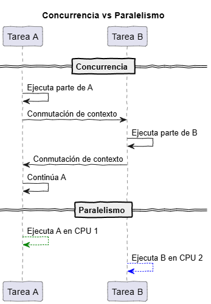
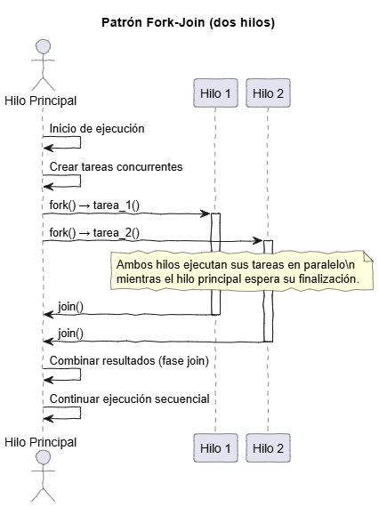
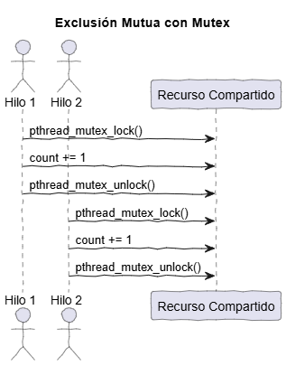

# Guía de Programación Concurrente con Pthreads

Este documento sirve como una introducción al modelo de programación concurrente utilizando la biblioteca POSIX Threads (`pthread`). Inicialemente se cubren los conceptos teóricos esenciales antes de abordar la implementación práctica.

## 1. Conceptos Fundamentales

Antes de escribir código, es crucial comprender el modelo de hilos y los desafíos que introduce.

### 1.1. ¿Qué es un Hilo (Thread)?

Un **hilo** (*thread*) es la unidad de ejecución más pequeña que puede ser gestionada por un sistema operativo. Un proceso tradicional consta de al menos un hilo (el *hilo principal*).

La diferencia clave entre un **proceso** y un **hilo** radica en cómo se maneja la memoria:

| Característica | Proceso | Hilo |
|:----------------|:--------|:-----|
| Espacio de memoria | Independiente | Compartido con otros hilos del mismo proceso |
| Comunicación | Explícita (pipes, sockets, etc.) | Implícita (variables globales, heap) |
| Costo de creación | Alto | Bajo |
| Aislamiento de fallos | Alto | Bajo |

### 1.2. El Modelo de Memoria Compartida

Este es el pilar de la programación con hilos.  
Todos los hilos dentro de un proceso comparten:

* El **segmento de código** (instrucciones del programa).
* El **segmento de datos** (variables globales y estáticas).
* El **heap** (memoria dinámica, p. ej., `malloc`).

Sin embargo, cada hilo tiene su **propia pila** (*stack*), lo que significa que las variables locales de una función son privadas para ese hilo.

**Ventaja:** la comunicación entre hilos es implícita y rápida.  
**Desventaja:** aparecen errores complejos como las **condiciones de carrera**.

### 1.3. Concurrencia vs. Paralelismo

Aunque a menudo se usan indistintamente, estos conceptos son distintos:
* **Concurrencia (Concurrency):** Se refiere a la capacidad de gestionar múltiples tareas *aparentemente* al mismo tiempo. En un sistema de un solo núcleo, el SO intercala la ejecución de los hilos (conmutación de contexto) para dar la ilusión de simultaneidad. El objetivo es gestionar recursos compartidos.
* **Paralelismo (Parallelism):** Se refiere a la ejecución *realmente* simultánea de múltiples tareas. Esto solo es posible en sistemas con múltiples núcleos de procesamiento. El objetivo es acelerar un cómputo dividiendo el trabajo.

<p align="center">
  
</p>


### 1.4. El Problema: Condiciones de Carrera (*Race Conditions*)

En programas concurrentes, varios hilos pueden intentar modificar simultáneamente un mismo recurso. Cuando esto ocurre sin una adecuada sincronización, se pueden producir resultados inconsistentes.

Una **condición de carrera** ocurre cuando el resultado del programa depende del orden impredecible en que los hilos completan sus operaciones sobre un recurso compartido.  
Este error no se debe a una falla en la lógica, sino al **entrelazamiento no controlado** de las instrucciones.

#### Ejemplo

```c
/* Each thread executes this function */
void *counting(void *end_value) {
    int i = 0;
    int upper = *((int *)end_value);    
    for (i = 1; i <= upper; i++) {
        // --- critical section ---
        count += 1;  
        // ------------------------
    }
    pthread_exit(0);
}   
```

La operación `count += 1` **no es atómica**. A nivel de máquina, se descompone en tres etapas:

1. **Lectura:** el valor actual de `count` se copia desde memoria a un registro.
2. **Modificación:** el registro incrementa su valor localmente.
3. **Escritura:** el nuevo valor se almacena nuevamente en memoria.

```asm
mov 0x8049a1c, %eax   ; cargar count en EAX
add $0x1, %eax        ; incrementar el registro
mov %eax, 0x8049a1c   ; guardar nuevo valor en memoria
```

#### Intercalación de instrucciones (una sola CPU)

| Paso | Hilo 1 | Hilo 2 | PC | EAX | `counter` |
|:----:|:--------|:--------|:----|:----|:----------|
| 1 | `mov 0x8049a1c, %eax` | — | `mov` H1 | **5** | 5 |
| 2 | — | `mov 0x8049a1c, %eax` | `mov` H2 | **5** | 5 |
| 3 | `add $0x1, %eax` | — | `add` H1 | **6** | 5 |
| 4 | — | `add $0x1, %eax` | `add` H2 | **6** | 5 |
| 5 | `mov %eax, 0x8049a1c` | — | `mov` H1 | **6** | **6** |
| 6 | — | `mov %eax, 0x8049a1c` | `mov` H2 | **6** | 🔴 **6 (valor incorrecto)** |

El valor esperado para `count` era **7**, pero se obtuvo **6**.  
Esto ocurre porque ambos hilos leyeron el mismo valor inicial antes de escribir, **perdiendo una actualización**.

Para resolverlo, se requiere **exclusión mutua**, garantizando que solo un hilo pueda ejecutar la sección crítica.

---

## 2. API Principal de `pthread`

La biblioteca `pthreads` es el estándar POSIX para la gestión de hilos en C.

### 2.1. Creación y Gestión de Hilos

La biblioteca proporciona funciones para manejar el ciclo de vida de un hilo.

* `pthread_create()`: Lanza un nuevo hilo que ejecutará una función específica.

    ```c
    #include <pthread.h>
    
    int pthread_create(
        pthread_t *thread,          // Puntero para almacenar el ID del nuevo hilo
        const pthread_attr_t *attr, // Atributos (usar NULL para default)
        void *(*start_routine)(void *), // Función que ejecutará el hilo
        void *arg                     // Argumento para pasar a la función
    );
    ```

* `pthread_join()`: Hace que el hilo llamante (p. ej., el `main`) espere a que un hilo específico termine su ejecución. Esto es crucial para sincronizar y asegurarse de que los resultados de un hilo están listos.

    ```c
    int pthread_join(
        pthread_t thread,   // ID del hilo que se debe esperar
        void **retval       // Puntero para recibir el valor de retorno del hilo (opcional)
    );
    ```

* `pthread_exit()`: Permite que un hilo termine su ejecución de forma explícita y, opcionalmente, devuelva un valor.

    ```c
    void pthread_exit(void *retval);
    ```

La siguiente figura muestra el patron **fork-join** usado cuando se emplean hilos:

<p align="center">
  
</p>


### 2.2. Sincronización: Exclusión Mutua (Mutex)

Como se demostró en el problema de la **Condición de Carrera** (sección 1.4), necesitamos un mecanismo para proteger la sección crítica (`count += 1`) y asegurar que solo un hilo pueda ejecutarla a la vez.

La herramienta fundamental para lograr esto es el **`mutex`** (**MUTual EXclusion**). Un `mutex` actúa como un "candado" (o *lock*) que un hilo debe "adquirir" antes de entrar a la sección crítica y "liberar" al salir.

Si un hilo intenta adquirir un mutex que ya está "tomado" por otro hilo, el sistema operativo bloqueará (pondrá a "dormir") al hilo solicitante. Este no despertará ni continuará su ejecución hasta que el hilo que posee el candado lo libere.


* `pthread_mutex_init()`: Inicializa un objeto mutex.
  
    ```c
    pthread_mutex_t my_mutex;
    pthread_mutex_init(&my_mutex, NULL); // NULL para atributos por defecto
    ```

* `pthread_mutex_lock()`: Adquiere el candado. Si está tomado, el hilo se bloquea.
  
    ```c
    pthread_mutex_lock(&my_mutex);
    // --- INICIO DE LA SECCIÓN CRÍTICA ---
    // ... código que accede al recurso compartido ...
    ```

* `pthread_mutex_unlock()`: Libera el candado, permitiendo que otros hilos bloqueados puedan adquirirlo.
  
    ```c
    // --- FIN DE LA SECCIÓN CRÍTICA ---
    pthread_mutex_unlock(&my_mutex);
    ```

* `pthread_mutex_destroy()`: Libera los recursos asociados al mutex.
    ```c
    pthread_mutex_destroy(&my_mutex);
    ```

#### Ejemplo con exclusión mutua

Retornando a la función previamente analizada(`counting`). Si se tiene un `pthread_mutex_t` llamado `my_mutex` el código que asegura exclusión mutua queda de la siguiente manera:

```c
/* The thread will execute in this function */
void *counting(void *end_value) {
    int i = 0;
    int upper = *((int *)end_value);    
    for (i = 1; i <= upper; i++) {
        pthread_mutex_lock(&my_mutex); // Lock
        // --- critical section ---
        count += 1;  
        // ------------------------
        pthread_mutex_unlock(&my_mutex); // Unlock
    }
    pthread_exit(0);
}   
```

<p align="center">
  
</p>


---

## 3. Casos de Estudio y Ejemplos

En los archivos de código proporcionados a continuación se aplican los conceptos previamente vistos.

|Ejemplos|Archivos|Descripción breve|
|---|---|---|
|Parte 1 [[link]](parte1/)|[example1.c](parte1/example1.c)|Ejemplo del patron **fork-join**|
|                         |[example2_rc.c](parte1/example2_rc.c)|Demostración del problema de condición de carrera|
|                         |[example2.c](parte1/example2.c)|Solución al problema de condición de carrera mediante exclusión mutua|
|Parte 2 [[link]](parte2/)|[suma_s.c](parte2/suma_s.c),[suma_p.c](parte2/suma_p.c)|Demostración del uso de paralelismo para acelerar una operacion de computo|

## Referencias

* https://hpc.llnl.gov/documentation/tutorials
* https://notes.shichao.io/apue/ch11/#chapter-11-threads
  
> [!Note]
> **AI Disclosure:** This document was created with the assistance of Artificial Intelligence language models. The content has been reviewed, edited, and validated by a human author to ensure accuracy and quality.