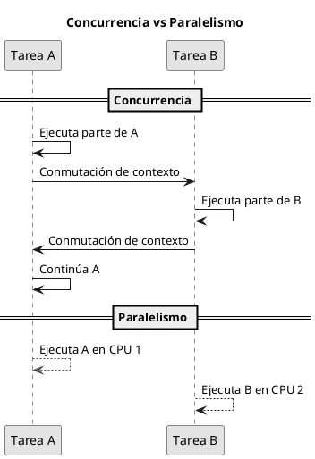
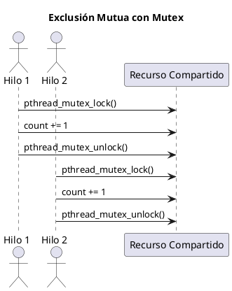

# Guía de Programación Concurrente con Pthreads

Este documento introduce el modelo de programación concurrente utilizando la biblioteca POSIX Threads (`pthread`). Primero se abordan los conceptos teóricos esenciales y luego se presentan ejemplos prácticos que ilustran su aplicación.

---

## 1. Conceptos Fundamentales

Antes de escribir código, es crucial comprender el modelo de hilos y los desafíos que introduce.

### 1.1. ¿Qué es un Hilo (Thread)?

Un **hilo** (*thread*) es la unidad de ejecución más pequeña que puede ser gestionada por un sistema operativo. Un proceso tradicional consta de al menos un hilo (el *hilo principal*).

La diferencia clave entre un **proceso** y un **hilo** radica en cómo se maneja la memoria:

| Característica | Proceso | Hilo |
|:----------------|:--------|:-----|
| Espacio de memoria | Independiente | Compartido con otros hilos del mismo proceso |
| Comunicación | Explícita (pipes, sockets, etc.) | Implícita (variables globales, heap) |
| Costo de creación | Alto | Bajo |
| Aislamiento de fallos | Alto | Bajo |

---

### 1.2. El Modelo de Memoria Compartida

Este es el pilar de la programación con hilos.  
Todos los hilos dentro de un proceso comparten:

* El **segmento de código** (instrucciones del programa).
* El **segmento de datos** (variables globales y estáticas).
* El **heap** (memoria dinámica, p. ej., `malloc`).

Sin embargo, cada hilo tiene su **propia pila** (*stack*), lo que significa que las variables locales de una función son privadas para ese hilo.

**Ventaja:** la comunicación entre hilos es implícita y rápida.  
**Desventaja:** aparecen errores complejos como las **condiciones de carrera**.

---

### 1.3. Concurrencia vs. Paralelismo

Aunque a menudo se usan como sinónimos, son conceptos distintos:

* **Concurrencia:** capacidad de manejar múltiples tareas *aparentemente simultáneas*. En un sistema de un solo núcleo, el SO intercala hilos (conmutación de contexto). El objetivo es gestionar recursos compartidos.
* **Paralelismo:** ejecución *realmente simultánea* de tareas en múltiples núcleos. El objetivo es acelerar el cómputo dividiendo el trabajo.



---

### 1.4. El Problema: Condiciones de Carrera (*Race Conditions*)

En programas concurrentes, varios hilos pueden intentar modificar simultáneamente un mismo recurso. Cuando esto ocurre sin una adecuada sincronización, se pueden producir resultados inconsistentes.

Una **condición de carrera** ocurre cuando el resultado del programa depende del orden impredecible en que los hilos completan sus operaciones sobre un recurso compartido.  
Este error no se debe a una falla en la lógica, sino al **entrelazamiento no controlado** de las instrucciones.

#### Ejemplo

```c
/* Each thread executes this function */
void *counting(void *end_value) {
    int i = 0;
    int upper = *((int *)end_value);    
    for (i = 1; i <= upper; i++) {
        // --- critical section ---
        count += 1;  
        // ------------------------
    }
    pthread_exit(0);
}   
```

La operación `count += 1` **no es atómica**. A nivel de máquina, se descompone en tres etapas:

1. **Lectura:** el valor actual de `count` se copia desde memoria a un registro.
2. **Modificación:** el registro incrementa su valor localmente.
3. **Escritura:** el nuevo valor se almacena nuevamente en memoria.

```asm
mov 0x8049a1c, %eax   ; cargar count en EAX
add $0x1, %eax        ; incrementar el registro
mov %eax, 0x8049a1c   ; guardar nuevo valor en memoria
```

#### Intercalación de instrucciones (una sola CPU)

| Paso | Hilo 1 | Hilo 2 | PC | EAX | `counter` |
|:----:|:--------|:--------|:----|:----|:----------|
| 1 | `mov 0x8049a1c, %eax` | — | `mov` H1 | **5** | 5 |
| 2 | — | `mov 0x8049a1c, %eax` | `mov` H2 | **5** | 5 |
| 3 | `add $0x1, %eax` | — | `add` H1 | **6** | 5 |
| 4 | — | `add $0x1, %eax` | `add` H2 | **6** | 5 |
| 5 | `mov %eax, 0x8049a1c` | — | `mov` H1 | **6** | **6** |
| 6 | — | `mov %eax, 0x8049a1c` | `mov` H2 | **6** | 🔴 **6 (valor incorrecto)** |

El valor esperado para `count` era **7**, pero se obtuvo **6**.  
Esto ocurre porque ambos hilos leyeron el mismo valor inicial antes de escribir, **perdiendo una actualización**.

Para resolverlo, se requiere **exclusión mutua**, garantizando que solo un hilo pueda ejecutar la sección crítica.

---

## 2. API Principal de `pthread`

La biblioteca `pthread` (POSIX Threads) es el estándar para manejar hilos en C.

### 2.1. Creación y Gestión de Hilos

**`pthread_create()`**  
Crea un nuevo hilo que ejecutará una función:

```c
#include <pthread.h>

int pthread_create(
    pthread_t *thread,          // ID del nuevo hilo
    const pthread_attr_t *attr, // Atributos (NULL por defecto)
    void *(*start_routine)(void *), // Función que ejecutará el hilo
    void *arg                   // Argumento para la función
);
```

**`pthread_join()`**  
El hilo llamante espera a que el hilo especificado finalice:

```c
int pthread_join(
    pthread_t thread,   // ID del hilo a esperar
    void **retval       // Valor de retorno (opcional)
);
```

**`pthread_exit()`**  
Finaliza un hilo explícitamente:

```c
void pthread_exit(void *retval);
```

---

### 2.2. Exclusión Mutua (Mutex)

Un **mutex** (*MUTual EXclusion*) actúa como un *candado*:  
solo un hilo puede entrar a la sección crítica mientras el mutex está bloqueado.

Si un hilo intenta adquirir un mutex ocupado, se bloquea hasta que el mutex se libere.

**Funciones principales:**

```c
pthread_mutex_t my_mutex;

pthread_mutex_init(&my_mutex, NULL);  // Inicialización
pthread_mutex_lock(&my_mutex);        // Adquiere el candado
// --- sección crítica ---
pthread_mutex_unlock(&my_mutex);      // Libera el candado
pthread_mutex_destroy(&my_mutex);     // Libera recursos
```

#### Ejemplo con exclusión mutua

```c
void *counting(void *end_value) {
    int i = 0;
    int upper = *((int *)end_value);    
    for (i = 1; i <= upper; i++) {
        pthread_mutex_lock(&my_mutex);   // Lock
        count += 1;                      // Sección crítica
        pthread_mutex_unlock(&my_mutex); // Unlock
    }
    pthread_exit(0);
}
```



---

## 3. Casos de Estudio y Ejemplos

### 3.1. Ejemplo 1: Creación y Espera (`example1.c`)

**Objetivo:** Demostrar el ciclo de vida básico de un hilo.  
**Descripción:** El `main` crea un hilo `runner` que calcula la suma de 1 a N.  
**Punto clave:** El `main` debe llamar a `pthread_join()` para esperar el resultado.  
Si no lo hace, podría imprimir un valor incompleto.

---

### 3.2. Ejemplo 2 (Fallido): Condición de Carrera (`example2_rc.c`)

**Objetivo:** Demostrar el peligro de las condiciones de carrera.  
**Descripción:** Varios hilos ejecutan `count += 1` simultáneamente.  
**Resultado esperado:** `count = num_hilos * n`  
**Resultado real:** `count` suele ser menor.  

💡 **Observa:** ejecuta el programa varias veces. El resultado cambia, evidenciando la condición de carrera.

---

### 3.3. Ejemplo 3 (Corregido): Uso de Mutex (`example2.c`)

**Objetivo:** Resolver la condición de carrera usando exclusión mutua.  
**Solución:** Se usa un `pthread_mutex_t` que protege `count += 1`.

```c
pthread_mutex_lock(&mutex);
count += 1;
pthread_mutex_unlock(&mutex);
```

**Resultado:** el valor final de `count` es siempre correcto.  
**Costo:** el programa es más lento debido a la sincronización, pero **correcto**.

---

### 3.4. Ejemplo 4: Paralelismo (`suma_s.c` vs `suma_p.c`)

**Objetivo:** Mostrar cómo el paralelismo puede acelerar tareas divisibles.  
**`suma_s.c` (serial):** suma dos vectores usando un único bucle.  
**`suma_p.c` (paralelo):** divide el trabajo entre varios hilos.

**Importante:**  
No se necesita mutex porque cada hilo trabaja sobre **una porción distinta** del vector, sin compartir variables mutables.

**Resultado:** `suma_p.c` se ejecuta más rápido en sistemas multinúcleo, demostrando el poder del paralelismo.

---

## Referencias

1. Silberschatz, A., Galvin, P., & Gagne, G. *Operating System Concepts*, 10th Ed. Wiley, 2018.  
2. Kerrisk, M. *The Linux Programming Interface*, No Starch Press, 2010.  
3. IEEE Std 1003.1-2017 (POSIX): Threads (`pthreads`) API Specification.  
4. GNU Project. *GNU C Library Documentation: POSIX Threads (pthread)*.  
